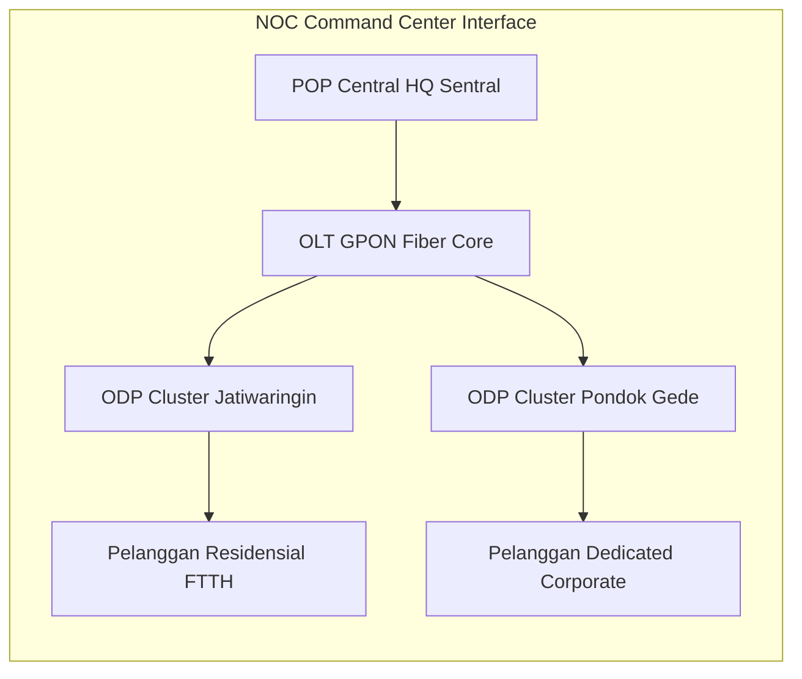
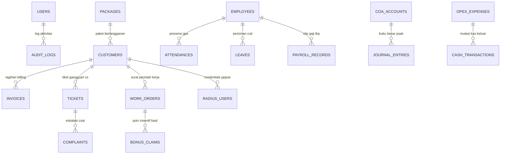
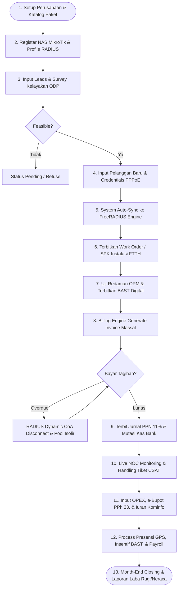

# 🚀 NETPRO CRM — ISP Management OS (Enterprise Edition v4.0.0)

[](#)
[](https://www.php.net)
[](https://www.postgresql.org)
[](https://freeradius.org)
[](https://mikrotik.com)
[](#)

**NETPRO CRM** adalah Sistem Operasi Manajemen Perusahaan Jasa Akses Internet (ISP) terpadu (*Enterprise ISP Management OS*) yang dirancang khusus untuk memfasilitasi operasional ISP di Indonesia. Sistem ini mengadopsi standar kepatuhan regulasi **Kominfo (USO & BHP)**, perpajakan resmi **DJP (PPN 11% & e-Bupot PPh 23)**, standar **Akuntansi Keuangan PSAK (72/73/16)**, serta arsitektur **Dual Database Dedicated FreeRADIUS**.

---

## 📑 DAFTAR ISI
- [✨ Fitur Unggulan Sistem](#-fitur-unggulan-sistem)
- [🖥️ Visualisasi Interface & Mockup UI](#%EF%B8%8F-visualisasi-interface--mockup-ui)
- [🏗️ Arsitektur & Desain Database (ERD 33 Tabel)](#%EF%B8%8F-arsitektur--desain-database-erd-33-tabel)
- [🔄 Flowchart Alur Penggunaan End-to-End](#-flowchart-alur-penggunaan-end-to-end)
- [⚡ Quick Start & Instalasi Lingkungan Server](#-quick-start--instalasi-lingkungan-server)
- [📖 Petunjuk Latihan & Input Data Praktik](#-petunjuk-latihan--input-data-praktik)
- [📜 Dokumentasi Lengkap Proyek](#-dokumentasi-lengkap-proyek)

---

## ✨ Fitur Unggulan Sistem

### 1. 🌐 FreeRADIUS & MikroTik Router NAS Integration (Protokol AAA & CoA)
- **Otentikasi PPPoE & Hotspot**: Terintegrasi langsung dengan database FreeRADIUS untuk proses dial-up pengguna.
- **Dynamic Change of Authorization (CoA Port 3799 / RFC 3576)**: Fitur auto-kick sesi aktif pengguna saat tagihan jatuh tempo (*Overdue*) atau upgrade paket bandwidth tanpa perlu reboot router.
- **Rate-Limit Queue Profile**: Pengaturan kecepatan upload/download dinamis (`Mikrotik-Rate-Limit`).
- **Real-Time Physical Hardware Probing**: Socket test langsung ke port MikroTik (8728), OLT (23/80), dan FreeRADIUS (1812/1813) murni mendeteksi fisik hardware di lapangan.

### 2. 📋 Onboarding FTTH, Work Order & BAST Digital
- **Validasi Pelanggan**: Pendaftaran pelanggan dengan NIK 16-digit, WhatsApp, dan koordinat GPS Leaflet Map.
- **Work Order (SPK) & OPM Testing**: Penugasan teknisi pasang baru, pencatatan Serial Number (SN) ONT, dan hasil ukur redaman optik OPM (dBm).
- **Auto-Generate BAST Digital**: Dokumen Berita Acara Serah Terima resmi yang dapat dicetak PDF atau dikirim otomatis via WhatsApp Bot.
- **Dynamic Stepper Wizard & Breadcrumbs**: Stepper chevron interaktif pada proses registrasi pelanggan (`crm/registrasi.php`).

### 3. 💵 Dual Billing Engine (Prabayar & Pascabayar), PPN 11% & Payment Gateway
- **Dual Mode Penagihan**:
  - **Prabayar (Prepaid FTTH)**: Mendukung *Billing Cycle (Rolling 30 Hari)* dan *Fixed Date (Reset Tanggal 1)*. Diberikan grace period 30 menit saat aktivasi dan tombol *Quick Top-Up*.
  - **Pascabayar (Postpaid Fixed Date)**: Tagihan bulanan rutin massal terbit tanggal 1 dengan tanggal jatuh tempo serentak **Tanggal 20**.
- **Automated Leap-Year Safe Scheduler Daemon**: CLI Daemon `cron/billing_scheduler.php` (`--all`, `--generate`, `--isolir`, `--reminder`) dengan Month-Safe Clamping kalender kabisat.
- **Skema Tagihan Awal**: Mendukung pilihan **Non-Prorata** (100% harga paket) dan **Prorata** (proporsional sisa hari bulan berjalan).
- **Perhitungan PPN 11% Residensial & Korporat**: Mendukung metode *Include PPN* ($\text{DPP} = \text{Total}/1.11$) dan *Exclude PPN* ($\text{PPN} = \text{DPP} \times 11\%$).
- **Midtrans & Notifikasi WA**: Terintegrasi dengan QRIS, Virtual Account BCA/Mandiri, dan bot reminder WhatsApp.
- **Auto-Isolir (Suspension)**: Pengalihan akun ter-suspend / expired ke IP Pool Isolir saat melewati masa aktif atau tanggal *Due Date*.

### 4. 📦 CRM Catalog Management (Full CRUD)
- **Paket Internet (`crm/paket.php`)**: Tambah, Edit kecepatan/harga/skema PPN, dan Hapus paket layanan.
- **Layanan Add-on (`crm/addon.php`)**: Manajemen IP Publik, Mesh WiFi, CCTV Cloud, dan IPTV.
- **Voucher Promo (`crm/promo.php`)**: Manajemen kode voucher diskon, kuota pemakaian, dan status kupon.

### 5. 📈 Akuntansi PSAK, e-Bupot PPh 23 & Regulasi Kominfo
- **Chart of Accounts (COA 34 Akun PSAK)**: Buku Besar Umum (*General Ledger*), Arus Kas Bank, dan Pengeluaran OPEX.
- **Sinkronisasi Jurnal Otomatis**: Setiap invoice lunas otomatis menjurnal Debit Kas/Bank dan Kredit Pendapatan & PPN Keluaran.
- **e-Bupot PPh 23 Unifikasi**: Penerbitan bukti potong 2% atas sewa upstream/tiang dan pencatatan kode **NTPN** setoran negara.
- **Iuran Kominfo PNBP**: Perhitungan otomatis **USO 1.25%** dan **BHP Telekomunikasi 0.50%** dari *Gross Revenue*.

### 6. 👷 HRD, Presensi GPS & Payroll THP
- **Presensi GPS Teknisi**: Clock-in/out lokasi kantor & lapangan.
- **Insentif Poin BAST**: Klaim bonus instalasi sukses per titik FTTH.
- **Payroll THP**: Penggajian otomatis yang menghitung gaji pokok, tunjangan, insentif BAST, dan potongan BPJS/PPh 21.

---

## 🖥️ Visualisasi Interface & Mockup UI

<div align="center">

### 1. Executive Dashboard & Core Telemetry UI
*Tampilan Utama Monitoring Telemetri Core RADIUS, Revenue Growth Chart, & Portofolio User*

| Header Bar | Core Status Badge | Latency | PPPoE Active | Peak Traffic |
| :---: | :---: | :---: | :---: | :---: |
| **NETPRO OS v4.0** | `ONLINE`🟢 | `0.12 ms` | `1,248 Users` | `8.42 Gbps` |

```gantt
    title Visual Wireframe: Executive Dashboard Layout
    section Telemetry Topbar
    RADIUS Engine Status (ONLINE)    :active, 0, 10
    Active Sessions (1248 Users)     :active, 10, 20
    Upstream Traffic (8.42 Gbps)     :active, 20, 30
    section Top KPI Cards
    Monthly Revenue (Rp 128.4M)      :crit, 0, 7
    Active Subscribers (1,248)       :done, 7, 15
    Open SLA Tickets (2 Cases)       :active, 15, 22
    Network Availability (99.92%)    :done, 22, 30
    section Analytics & Maps
    Revenue & User Growth Line Chart :active, 0, 20
    Bandwidth Donut Distribution     :active, 20, 30
```

---

### 2. NOC Command Center & Coverage GIS Map UI
*Monitoring Trafik IP Transit Tier-1, Penanganan Cable Cut, & Peta Sebaran ODP Leaflet GIS*

| Metric NOC | Nilai Real-Time | Status SLA | Target Redaman OPM |
| :--- | :--- | :---: | :---: |
| **Upstream Bandwidth** | **8.42 Gbps / 10 Gbps** | 🟢 Optimal | Max `-24.00 dBm` |
| **Network SLA Availability** | **99.92%** | 🟢 Passed | Excellent: `-18.40 dBm` |
| **MTTR (Mean Time to Repair)** | **38 Menit** | 🟢 In Target | Fast Splicing Team |



---

### 3. Dashboard Billing, PPN 11% & e-Bupot PPh 23 UI
*Manajemen Invoice Massal, Skema Include/Exclude PPN 11%, e-Bupot PPh 23, & Invoice Aging Matrix*

| Matriks Billing | Nominal (Rp) | Keterangan Status |
| :--- | :--- | :--- |
| **Monthly Recurring Revenue (MRR)** | **Rp 128.400.000** | Total Tagihan Lunas Periode Berjalan |
| **Unpaid Accounts (Piutang)** | **Rp 8.750.000** | 35 Invoice Belum Terbayar |
| **Rata-Rata ARPU Pelanggan** | **Rp 275.000 / User** | Per Bulanan FTTH |
| **PPN 11% Keluaran Titipan** | **Rp 14.124.000** | Terpukul Jurnal Otomatis (`2103`) |
| **e-Bupot PPh 23 (2.0%)** | **Rp 100.000** | Sewa Upstream Vendor (Kode NTPN Valid) |

---

### 4. Berita Acara Serah Terima (BAST Digital) & Uji OPM UI
*Dokumen BAST Digital Resmi Hasil Pemasangan FTTH dan Uji Redaman Fiber Optik*

```text
========================================================================================
                      BERITA ACARA SERAH TERIMA (BAST) INSTALASI FTTH
                        PT NETPRO TELEKOMUNIKASI INDONESIA
========================================================================================
 Dokumen SPK     : WO-2026-0089                       Tanggal Pasang : 24 Agustus 2026
 Nama Pelanggan  : Budi Wijaya                        ID Pelanggan   : CID-2026-0142
 Paket Internet  : Home Premium 50 Mbps (Include PPN) Username PPPoE : 32750109-BUDI
----------------------------------------------------------------------------------------
 DETAIL PERANGKAT & UJI REDAMAN FIBER OPTIK (OPM)
 Serial Number ONT : ZTEG88910283 (Modem Dualband ZTE F670L)
 Kode ODP / Port   : ODP-JTW-04/16 (Port 3)
 Hasil Uji Sinyal  : -18.40 dBm (Kategori: EXCELLENT / BAGUS SANGAT LAYAK)
----------------------------------------------------------------------------------------
 Tanda Tangan Digital Teknisi Lapangan            Tanda Tangan Digital Pelanggan
 [ Signed: Rian Hidayat - NOC Tech ]              [ Signed: Budi Wijaya ]
========================================================================================
```

</div>

---

## 🏗️ Arsitektur & Desain Database (ERD 33 Tabel)

Sistem didukung oleh **33 Tabel Database** yang saling terintegrasi melalui *Foreign Key Cascading*:



---

## 🔄 Flowchart Alur Penggunaan End-to-End



---

## ⚡ Quick Start & Instalasi Lingkungan Server

### 1. Kebutuhan Sistem & Dependensi:
- **Web Server**: Apache 2.4 / Nginx / PHP Built-in Server.
- **PHP**: versi 8.0 atau lebih baru (Extension: `pdo`, `pdo_pgsql`, `pdo_sqlite`).
- **Database Engine**: PostgreSQL 14+ (Utama) atau SQLite3 (Fallback otomatis).
- **RADIUS Engine**: FreeRADIUS 3.0+ & RouterOS v7 MikroTik.

### 2. Perintah Jalankan Server Lokal Development:
Buka terminal pada folder proyek `d:\PG\BILL-DASH`, lalu jalankan:
```bash
php -S localhost:8000
```
Buka browser Anda di `http://localhost:8000/dashboard/utama.php`.

### 3. Akun Login Superadmin Utama:
- **URL Login**: `http://localhost:8000/login.php`
- **Username**: `superadmin`
- **Password**: `admin123`

---

## 📖 Petunjuk Latihan & Input Data Praktik

Bagi Anda yang ingin menguji coba penginputan data dari kondisi database bersih (0 data):

1. **Kosongkan Database (Reset to Zero)**:
   ```bash
   php database/reset.php
   ```
2. **Ikuti Panduan Praktik Langkah-demi-Langkah**:
   Buka file petunjuk latihan di [`WALKTHROUGH_DAN_PETUNJUK_INPUT_DATA.md`](file:///d:/PG/BILL-DASH/WALKTHROUGH_DAN_PETUNJUK_INPUT_DATA.md) untuk mempelajari skenario penginputan data pelanggan `Budi Wijaya`, uji ukur OPM, pembayaran PPN 11%, e-Bupot PPh 23, dan payroll.

---

## 📜 Dokumentasi Lengkap Proyek

Seluruh dokumentasi teknis dan operasional tersimpan rapat dalam repositori ini:

1. 📘 [**Panduan Resmi Alur Penggunaan NETPRO CRM**](file:///d:/PG/BILL-DASH/PANDUAN_RESMI_ALUR_PENGGUNAAN_NETPRO_CRM.md) — Manual operasional end-to-end 8 tahap.
2. 📗 [**Walkthrough & Petunjuk Input Data**](file:///d:/PG/BILL-DASH/WALKTHROUGH_DAN_PETUNJUK_INPUT_DATA.md) — Tutorial uji coba input data sampel dari nol.
3. 📙 [**Dokumentasi Integrasi RADIUS NAS & CoA**](file:///d:/PG/BILL-DASH/DOKUMENTASI_INTEGRASI_RADIUS_NAS_DAN_COA.md) — Spesifikasi teknis FreeRADIUS, CoA Port 3799, & RouterOS CLI.
4. 📕 [**Dokumentasi Keuangan, Pajak & Regulasi ISP**](file:///d:/PG/BILL-DASH/DOKUMENTASI_STANDAR_KEUANGAN_DAN_REGULASI_ISP.md) — Standar akuntansi PSAK 72/73/16, e-Bupot PPh 23, PPN 11%, dan Iuran Kominfo (USO & BHP).
5. 💳 [**Dokumentasi Sistem Billing Prabayar, Pascabayar & Prorata**](file:///d:/PG/BILL-DASH/DOKUMENTASI_SISTEM_BILLING_PRABAYAR_PASCABAYAR_DAN_PRORATA.md) — SOP penagihan Fixed Date tgl 20, Rolling Date 30 hari, dan simulasi Prorata.
6. 📒 [**Dokumentasi Autentikasi & RBAC Role**](file:///d:/PG/BILL-DASH/DOKUMENTASI_AUTENTIKASI_SESSION_DAN_RBAC_ISP.md) — Manajemen role Superadmin, NOC, CS, Billing, & Teknisi.

---

*Hak Cipta © 2026 PT NETPRO TELEKOMUNIKASI INDONESIA. Seluruh Hak Dilindungi Undang-Undang.*
