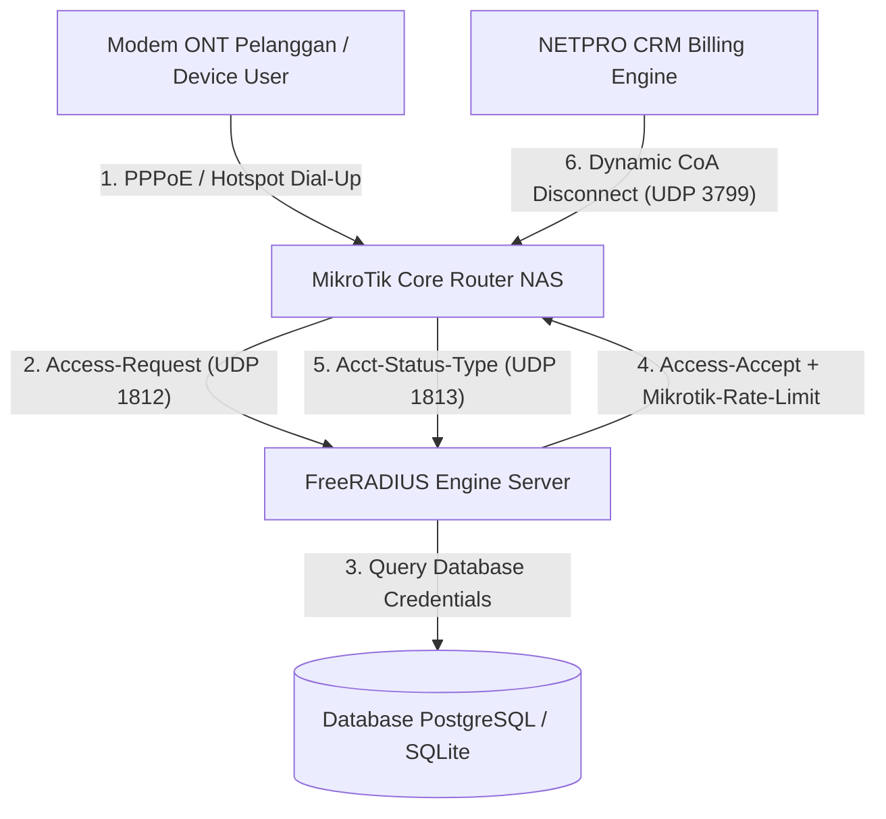
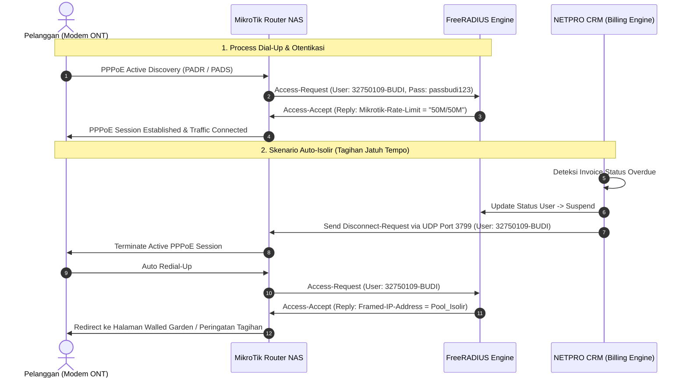
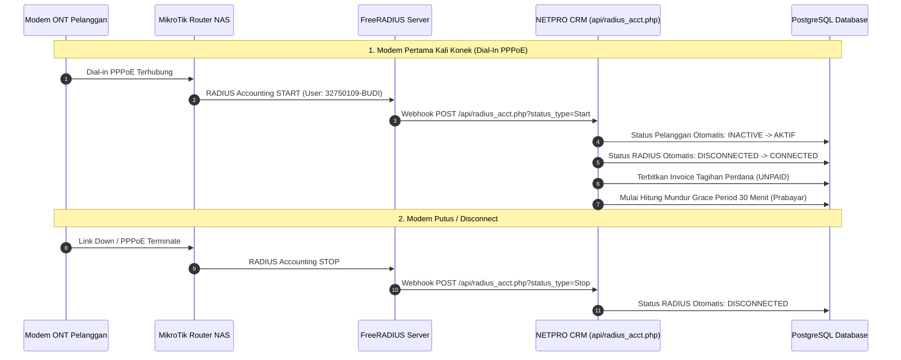

# 🌐 DOKUMENTASI LENGKAP INTEGRASI RADIUS NAS, PROFIL BANDWIDTH & CHANGE OF AUTHORIZATION (CoA PORT 3799)

**Panduan Arsitektur AAA, Konfigurasi RouterOS MikroTik, FreeRADIUS, & Manajemen Sesi Aktif**  
**Aplikasi: NETPRO CRM (ISP Management OS)**

---

## 📑 DAFTAR ISI
1. [Landasan Arsitektur RADIUS & Protokol AAA](#1-landasan-arsitektur-radius--protokol-aaa)
2. [Konsep Change of Authorization (CoA Port 3799 / RFC 3576)](#2-konsep-change-of-authorization-coa-port-3799--rfc-3576)
3. [Diagram Urutan (Sequence & Flowchart) Dial-Up & CoA](#3-diagram-urutan-sequence--flowchart-dial-up--coa)
4. [Panduan Konfigurasi MikroTik RouterOS & FreeRADIUS Engine](#4-panduan-konfigurasi-mikrotik-routeros--freeradius-engine)
5. [SOP Operasional Modul RADIUS pada Aplikasi NETPRO CRM](#5-sop-operasional-modul-radius-pada-aplikasi-netpro-crm)
   - 5.1. [Router NAS MikroTik (`radius/nas.php`)](#51-router-nas-mikrotik-radiusnasphp)
   - 5.2. [Credentials PPPoE & Hotspot Users (`radius/users.php`)](#52-credentials-pppoe--hotspot-users-radiususersphp)
   - 5.3. [Profil Kecepatan & Rate Limit (`radius/profiles.php`)](#53-profil-kecepatan--rate-limit-radiusprofilesphp)
   - 5.4. [Hotspot Batch Voucher Generator (`radius/vouchers.php`)](#54-hotspot-batch-voucher-generator-radiusvouchersphp)
   - 5.5. [Live Session Monitoring (`radius/sessions.php`)](#55-live-session-monitoring-radiussessionsphp)
6. [Panduan Pengujian CLI radclient & Troubleshooting CoA](#6-panduan-pengujian-cli-radclient--troubleshooting-coa)

---

## 1. Landasan Arsitektur RADIUS & Protokol AAA

Sistem **NETPRO CRM** mengadopsi arsitektur **AAA (Authentication, Authorization, Accounting)** standar industri telekomunikasi untuk mengontrol akses internet pelanggan broadband FTTH dan Hotspot:



### Pilar Utama Protokol AAA:
1. **Authentication (Otentikasi)**: Memverifikasi keabsahan username dan password PPPoE/Hotspot saat pelanggan mencoba *dial-up*.
2. **Authorization (Otorisasi)**: Memberikan parameter batasan kecepatan (*Rate-Limit Upload/Download*), alokasi IP Address Static/Dynamic Pool, dan status akun.
3. **Accounting (Pencatatan Sesi)**: Mencatat waktu mulai koneksi (*Acct-Session-Time*), alokasi IP, serta volume pemakaian data byte (*Acct-Input-Octets* & *Acct-Output-Octets*).

---

## 2. Konsep Change of Authorization (CoA Port 3799 / RFC 3576)

**CoA (Change of Authorization)** didefinisikan dalam RFC 3576 & RFC 5176 sebagai mekanisme untuk **mengubah atribut sesi atau memutus (*kick*) koneksi pelanggan secara dinamis** tanpa meminta pelanggan memasukkan ulang password.

### Paket Utama CoA:
- **CoA-Request**: Mengirimkan perintah pembaruan atribut sesi aktif (misalnya mengubah parameter `Mikrotik-Rate-Limit` dari 20M ke 50M saat upgrade paket).
- **Disconnect-Request (DM / PoD - Packet of Disconnect)**: Mengirimkan perintah pemutusan koneksi secara instan (misalnya saat tagihan jatuh tempo / *Overdue*).

> [!IMPORTANT]
> **Port Standar CoA**: MikroTik RouterOS menerima paket CoA pada **UDP Port 3799** (atau Port 1700). Router NAS harus membuka port UDP 3799 dan mengaktifkan fitur `incoming` RADIUS.

---

## 3. Diagram Urutan (Sequence & Flowchart) Dial-Up & CoA

### Diagram Urutan Process Dial-Up & Dynamic CoA Disconnect:



---

## 4. Panduan Konfigurasi MikroTik RouterOS & FreeRADIUS Engine

### A. Konfigurasi pada Router MikroTik RouterOS (Terminal CLI)
Jalankan perintah berikut pada terminal Winbox / SSH MikroTik Core Router:

```routeros
# 1. Daftarkan RADIUS Server untuk Service PPP dan Hotspot
/radius add service=ppp,hotspot address=10.100.0.1 secret="radiussecret123" timeout=3s

# 2. Aktifkan Fitur AAA pada PPPoE Server
/ppp aaa set use-radius=yes accounting=yes interim-update=5m

# 3. Aktifkan Incoming CoA (Disconnect Request) pada Port UDP 3799
/radius incoming set accept=yes port=3799

# 4. Buat IP Address Pool untuk Pelanggan Normal & Isolir
/ip pool add name=pool_pppoe_home ranges=10.100.10.10-10.100.10.250
/ip pool add name=pool_isolir ranges=172.16.99.10-172.16.99.250
```

### B. Konfigurasi pada FreeRADIUS Engine (`/etc/raddb/clients.conf`)
Tambahkan definisi Router NAS MikroTik pada file konfigurasi FreeRADIUS:

```conf
client ccr-core-hq {
    ipaddr = 10.100.0.1
    secret = radiussecret123
    shortname = NAS-HQ-01
    nastype = mikrotik
}
```

---

## 5. SOP Operasional Modul RADIUS pada Aplikasi NETPRO CRM

### 5.1. Router NAS MikroTik ([`radius/nas.php`](file:///d:/PG/BILL-DASH/radius/nas.php))
- **Fungsi**: Daftarkan seluruh Router Core / Aggregation yang bertindak sebagai Network Access Server.
- **Form Input**:
  - **Nama NAS**: `CCR-CORE-HQ-01`
  - **IP Address**: `10.100.0.1`
  - **Model Hardware**: `MikroTik CCR2004-16G-2S+`
  - **Radius Secret**: `radiussecret123`
- **Indikator Telemetri**: Menampilkan status listener **`Auth CoA / Disconnect PORT 3799 Auto-Kick Active`**.

---

### 5.2. Credentials PPPoE & Hotspot Users ([`radius/users.php`](file:///d:/PG/BILL-DASH/radius/users.php))
- **Fungsi**: Mengelola akun dial-up pelanggan FTTH dan pelanggan Hotspot RT/RW Net.
- **Fitur Utama**:
  - **Auto Sync**: Setiap pendaftaran pelanggan di CRM ([`crm/pendaftaran.php`](file:///d:/PG/BILL-DASH/crm/pendaftaran.php)) otomatis mendaftarkan credentials di tabel `radius_users`.
  - **Tombol `Hapus / Kick`**: Mengirimkan perintah CoA Disconnect via port 3799 ke router NAS untuk memutus sesi aktif user secara instan.

---

### 5.3. Profil Kecepatan & Rate Limit ([`radius/profiles.php`](file:///d:/PG/BILL-DASH/radius/profiles.php))
- **Fungsi**: Mengatur batasan kecepatan bandwidth upload/download per paket internet.
- **Tabel Profil**:

| Nama Profil RADIUS | Rate Limit (Upload / Download) | Burst Limit | Address Pool | Keterangan |
| :--- | :--- | :--- | :--- | :--- |
| `PROFILE_HOME_20M` | `20M/20M` | `30M/30M 24M/24M 10/10` | `pool_pppoe_home` | Paket Home Lite 20 Mbps |
| `PROFILE_HOME_50M` | `50M/50M` | `75M/75M 60M/60M 10/10` | `pool_pppoe_home` | Paket Home Premium 50 Mbps |
| `PROFILE_GAMER_100M` | `100M/100M` | `150M/150M 120M/120M 10/10` | `pool_pppoe_gamer` | Paket Gamer Ultimate 100 Mbps |
| `PROFILE_ISOLIR` | `512k/512k` | `-` | `pool_isolir` | Profil Khusus Suspend Tagihan |

---

### 5.4. Hotspot Batch Voucher Generator ([`radius/vouchers.php`](file:///d:/PG/BILL-DASH/radius/vouchers.php))
- **Fungsi**: Meng-generate batch voucher hotspot berlangganan jam-jaman/harian untuk lokasi fasilitas umum / cafe / RT Net.
- **Parameter**: Batch Code (`BATCH-2026-001`), Durasi Masa Aktif (`2 Jam` / `24 Jam`), Qty Cetak (`100 Voucher`), dan Harga (`Rp 3.000`).

---

### 5.5. Live Session Monitoring ([`radius/sessions.php`](file:///d:/PG/BILL-DASH/radius/sessions.php))
- **Fungsi**: Memantau sesi pelanggan terhubung (*Active Sessions*), alokasi IP Address, Uptime koneksi, dan pemakaian kuota data (Download/Upload Octets).

---

### 5.6. Otomatisasi Real-Time: FreeRADIUS Accounting & MikroTik Webhook ([`api/radius_acct.php`](file:///d:/PG/BILL-DASH/api/radius_acct.php))
Sistem NETPRO CRM dilengkapi endpoint otomatisasi jaringan yang menerima sinyal akuntansi sesi PPPoE secara real-time:



#### Script PPP Profile di MikroTik RouterOS (Aktivasi Otomatis Real-Time):
Tambahkan konfigurasi berikut pada Router MikroTik agar setiap kali pelanggan melakukan dial-up, NETPRO CRM langsung merespon otomatis:
```routeros
/ppp profile set default on-up="/tool fetch url=\"http://IP-SERVER-CRM:8000/api/radius_acct.php?username=\$user&status_type=Start\" keep-result=no"
/ppp profile set default on-down="/tool fetch url=\"http://IP-SERVER-CRM:8000/api/radius_acct.php?username=\$user&status_type=Stop\" keep-result=no"
```

---

## 6. Panduan Pengujian CLI radclient & Troubleshooting CoA

### A. Pengujian Perintah Paket Disconnect CoA via CLI (`radclient`)
Jika Anda memiliki akses terminal Linux Server FreeRADIUS, Anda dapat menguji pengiriman paket CoA Disconnect ke MikroTik NAS secara manual:

```bash
# Kirim paket Disconnect-Request ke MikroTik NAS di IP 10.100.0.1 Port 3799
echo "User-Name = 32750109-BUDI" | radclient -x 10.100.0.1:3799 disconnect "radiussecret123"
```

### Output Pengujian Sukses (Disconnect ACK):
```text
Sending Disconnect-Request to 10.100.0.1 port 3799
    User-Name = "32750109-BUDI"
Received Disconnect-ACK id 160 from 10.100.0.1:3799 length 20
```

### B. Matriks Troubleshooting CoA & RADIUS:

| Gejala Masalah | Kemungkinan Penyebab | Langkah Solusi Perbaikan |
| :--- | :--- | :--- |
| **Paket CoA Timed Out / No Response** | Firewall MikroTik memblokir UDP 3799 | Buka port UDP 3799 pada Firewall Filter `/ip firewall filter add chain=input dst-port=3799 protocol=udp action=accept` |
| **Received Disconnect-NAK / Error** | Feature Incoming RADIUS belum diaktifkan | Jalankan `/radius incoming set accept=yes port=3799` di Winbox |
| **Error Authentication Failed** | RADIUS Secret di CRM & MikroTik berbeda | Pastikan kata sandi secret di [`radius/nas.php`](file:///d:/PG/BILL-DASH/radius/nas.php) sama persis dengan `/radius` di RouterOS |
| **User Tidak Ter-Isolir** | Account masih menggunakan IP Static manual | Pastikan otentikasi menggunakan RADIUS Profile & IP Pool dinamis |
