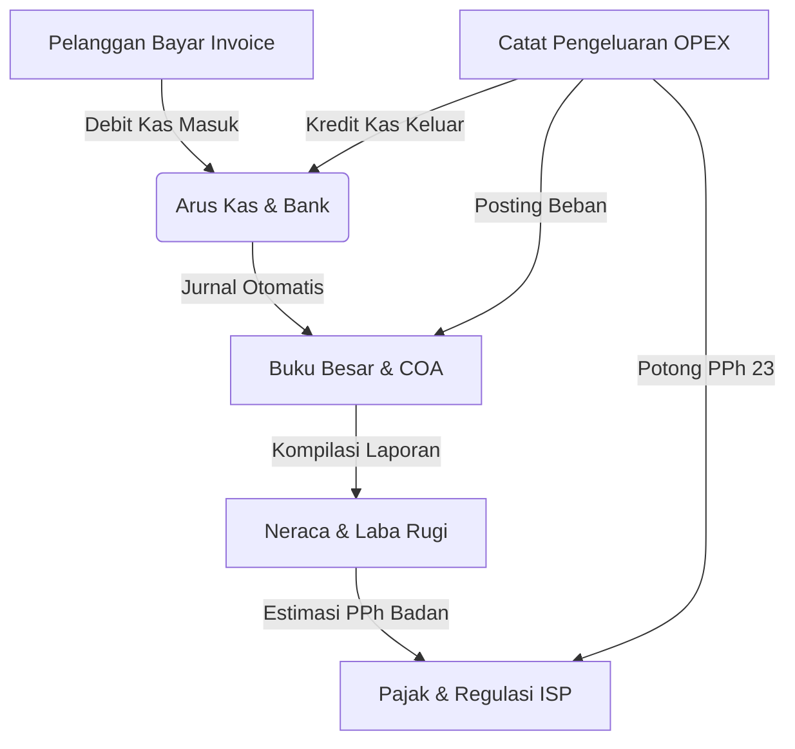

# 📘 Panduan Penggunaan & Manual Input Data Modul Finance (Keuangan & Akuntansi ISP)

Dokumen ini berisi panduan lengkap tata cara penggunaan, alur kerja akuntansi, dan instruksi langkah-demi-langkah penginputan data pada seluruh submenu **Finance (Keuangan & Akuntansi)** pada aplikasi **NETPRO CRM (ISP Management OS)**.

---

## 🗺️ Peta Modul Finance

Modul Finance terdiri dari 5 submenu utama yang saling terintegrasi secara otomatis dengan modul Billing, Payroll, dan Pengaturan:

---

## 1. 💳 Arus Kas & Rekening Bank (`finance/kas.php`)

### A. Fungsi Menu:
Digunakan untuk memantau saldo likuiditas kas perusahaan secara *real-time* pada multi-rekening (**Bank BCA Bisnis**, **Bank Mandiri Corporate**, dan **Kas Tunai HQ**), serta mencatat mutasi pemasukan/pengeluaran harian dan rekonsiliasi rekening koran bank.

### B. Cara Input Mutasi Kas Baru:
1. Buka menu **Keuangan & Akuntansi ➔ [Arus Kas & Bank](file:///d:/PG/BILL-DASH/finance/kas.php)**.
2. Klik tombol biru **`+ Catat Transaksi Kas`** di pojok kanan atas tabel.
3. Pada modal popup yang muncul, lengkapi formulir:
   - **Tipe Mutasi**: Pilih *Pemasukan (Debit)* jika kas bertambah, atau *Pengeluaran (Kredit)* jika kas berkurang.
   - **Akun Keuangan**: Pilih rekening yang mengalami mutasi (*Bank BCA Bisnis*, *Bank Mandiri*, atau *Kas Tunai Kantor*).
   - **Jumlah Nominal (Rp)**: Masukkan angka nominal (contoh: `1500000`).
   - **Keterangan Transaksi**: Isi uraian mutasi (contoh: *Penerimaan kasir tunai pembayaran pasang baru Budi Wijaya*).
4. Klik tombol **`Simpan Mutasi Kas`**.
5. Saldo rekening dan total likuiditas kas akan otomatis ter-update di database.

---

## 2. 🧾 Pengeluaran Operasional OPEX (`finance/pengeluaran.php`)

### A. Fungsi Menu:
Digunakan untuk mendokumentasikan seluruh beban operasional rutin ISP (sewa upstream bandwidth, tiang tumpu fiber optik, listrik POP server room, BBM armada lapangan, dan lisensi software).

### B. Cara Input Pengeluaran OPEX:
1. Buka menu **Keuangan & Akuntansi ➔ [Pengeluaran OPEX](file:///d:/PG/BILL-DASH/finance/pengeluaran.php)**.
2. Klik tombol **`+ Catat Pengeluaran`**.
3. Lengkapi isian formulir:
   - **Kategori Beban**: Pilih jenis beban (*Sewa Bandwidth Upstream*, *Sewa Tiang & Right of Way*, *Listrik POP*, *BBM & Transport Teknisi*, *Lisensi Software*, dll).
   - **Penerima Dana / Nama Vendor**: Nama rekanan (contoh: *PT Telkom Indonesia*, *PT PLN Icon+*).
   - **Akun Pembayaran**: Rekening yang digunakan untuk membayar (*Bank BCA*, *Bank Mandiri*, *Kas Tunai*).
   - **Jumlah Nominal (Rp)**: Nilai tagihan yang dibayarkan.
   - **Uraian / Deskripsi Pengeluaran**: Rincian tagihan (contoh: *Sewa IP Transit Core 10G Bulan Juni 2026*).
   - **Pemberi Otorisasi (Approver)**: Jabatan pejabat penyetuju (contoh: *Manager Finance* / *Direktur Operasional*).
4. Klik tombol **`Simpan & Ajukan Pengeluaran`**.
5. Sistem akan:
   - Menerbitkan **Nomor Voucher Resmi (`VCH-OPEX-xxxx`)**.
   - Otomatis mencatat pengeluaran (*Kredit*) pada menu **Arus Kas & Bank**.

---

## 3. 📖 Buku Besar & Bagan Akun Standar COA (`finance/akuntansi.php`)

### A. Fungsi Menu:
Menyediakan master **Chart of Accounts (COA)** yang telah diselaraskan dengan standar akuntansi Indonesia (**PSAK 72 / 115**, **PSAK 73**, dan **PSAK 16**) serta fitur **Buku Besar Umum (General Ledger)**.

### B. Cara Input Akun COA Baru:
1. Buka menu **Keuangan & Akuntansi ➔ [Buku Besar & COA](file:///d:/PG/BILL-DASH/finance/akuntansi.php)**.
2. Pastikan berada pada tab **Bagan Akun (COA)**.
3. Klik tombol **`+ Tambah Akun COA`**.
4. Lengkapi formulir:
   - **Kode Akun**: Masukkan kode unik numerik (contoh: `1104` untuk Bank BNI).
   - **Nama Akun Akuntansi**: Nama akun (contoh: *Bank BNI Corporate Giro*).
   - **Klasifikasi Kategori**: Pilih kelompok (*1-xxxx Aset Lancar*, *1-xxxx Aset Tetap*, *2-xxxx Liabilitas*, *3-xxxx Ekuitas*, *4-xxxx Pendapatan*, *5-xxxx Beban Pokok COGS*, *6-xxxx OPEX*).
   - **Saldo Normal**: Tentukan posisi normal akun (*Debit* atau *Kredit*).
   - **Saldo Awal (Rp)**: Masukkan saldo pembukaan jika ada.
5. Klik **`Simpan Akun COA ke Database`**.

### C. Cara Melihat & Input Mutasi Jurnal Buku Besar:
1. Klik tombol **`Buku Besar →`** pada baris akun yang ingin diperiksa, atau klik tab **Buku Besar (General Ledger)** di atas.
2. Pilih akun dari dropdown filter untuk melihat rincian tanggal, nomor jurnal (`JRN-xxxx`), uraian, debit/kredit, dan saldo kumulatif.
3. Untuk memposting jurnal manual, klik **`+ Mutasi Jurnal`**, isi data transaksi, dan klik **`Posting Jurnal ke Buku Besar`**. Saldo akun COA akan otomatis disesuaikan.

---

## 4. 📈 Neraca & Laba Rugi Komprehensif (`finance/laporan.php`)

### A. Fungsi Menu:
Menampilkan posisi keuangan formal ISP dalam bentuk **Laporan Laba Rugi (Income Statement)** dan **Neraca Keuangan (Balance Sheet: Aktiva vs Passiva)** yang seimbang 100%.

### B. Cara Membaca & Menggunakan:
1. Buka menu **Keuangan & Akuntansi ➔ [Neraca & Laba Rugi](file:///d:/PG/BILL-DASH/finance/laporan.php)**.
2. Gunakan **Selector Periode** di panel atas untuk memilih bulan/kuartal yang ingin dianalisis.
3. **Membaca Laporan Laba Rugi (Kolom Kiri)**:
   - *Pendapatan Usaha (Revenue)* dikurangi *Beban Pokok (COGS)* menghasilkan **Laba Kotor (Gross Profit)**.
   - *Laba Kotor* dikurangi *Beban Operasional (OPEX)* menghasilkan **Laba Bersih Tahun Berjalan (Net Profit)**.
4. **Membaca Neraca Keuangan (Kolom Kanan)**:
   - *Total Aset (Aktiva Lancar + Aset Tetap Fiber/Server)* harus sama persis dengan *Total Passiva (Kewajiban Hutang + Ekuitas Modal)*. Indikator hijau **`BALANCED ✓`** menunjukkan neraca seimbang.
5. Klik tombol **`📄 Cetak Laporan PDF`** untuk mencetak dokumen resmi laporan keuangan atau **`📊 Export Excel`** untuk mengunduh rekap spreadsheet.

---

## 5. 🏛️ Pajak & Regulasi ISP (`finance/pajak.php`)

### A. Fungsi Menu:
Digunakan untuk mengelola kewajiban perpajakan non-PPN resmi industri telekomunikasi (PPh 21 Gaji Staf, PPh 23 e-Bupot Vendor Sewa Tiang/Bandwidth, Estimasi PPh Badan Pasal 25, dan Iuran Regulasi Kominfo BHP/USO).

### B. Cara Menerbitkan Bukti Potong PPh 23 (e-Bupot Baru):
1. Buka menu **Keuangan & Akuntansi ➔ [Pajak & Regulasi ISP](file:///d:/PG/BILL-DASH/finance/pajak.php)**.
2. Klik tombol biru **`+ Terbitkan e-Bupot PPh 23`**.
3. Lengkapi formulir:
   - **Nama Vendor / Rekanan Mitra**: Masukkan nama mitra (contoh: *PT Moratelindo Fiber Utama*).
   - **NPWP Vendor (16 Digit)**: Nomor NPWP vendor berformat `01.234.567.8-000.000`.
   - **Jenis Pajak**: Pilih *PPh 23 (Sewa & Jasa)* atau *PPh 4 ayat 2 (Sewa Gedung/POP)*.
   - **Objek Penghasilan**: Uraian transaksi (contoh: *Sewa Metro-E Backhaul 10G*).
   - **Dasar Pengenaan Pajak (DPP)**: Nilai transaksi sebelum pajak (contoh: `15000000`).
   - **Tarif Pajak (%)**: Standar 2.0%.
4. Klik **`Terbitkan Bukti Potong e-Bupot`**.
5. Nilai pemotongan pajak (Rp 300.000) akan dihitung otomatis dan tersimpan di database dengan nomor unik **`BUPOT-23-xxxx`**.

### C. Cara Menginput Bukti Setor Pajak (NTPN):
1. Pada tabel Bukti Potong PPh 23, cari baris bukti potong yang belum lunas.
2. Klik tombol kuning **`Input NTPN Bayar →`**.
3. Masukkan kode **Nomor Transaksi Penerimaan Negara (NTPN)** 16 digit yang tertera pada bukti transfer bank persepsi/e-Billing DJP.
4. Klik **`Simpan NTPN & Tandai Lunas`**. Status dokumen akan berubah menjadi **`✓ LUNAS`**.

---

## 💡 Tips & Praktik Terbaik (Best Practices) Keuangan ISP:
- **Tutup Buku Bulanan (Closing)**: Lakukan closing setiap tanggal 1 bulan berikutnya dengan memastikan seluruh pembayaran tagihan invoice pelanggan telah terverifikasi di kasir dan seluruh nota OPEX teknisi telah diinput.
- **Pemisahan Rekening**: Jangan mencampur rekening penampungan pembayaran pelanggan (*Bank BCA Giro*) dengan kas kecil harian (*Petty Cash HQ*).
- **Kepatuhan Pajak**: Setorkan PPh 21, PPh 23, dan PPN paling lambat tanggal 10 atau 15 bulan berikutnya, serta iuran BHP/USO Kominfo secara berkala setiap kuartal.
