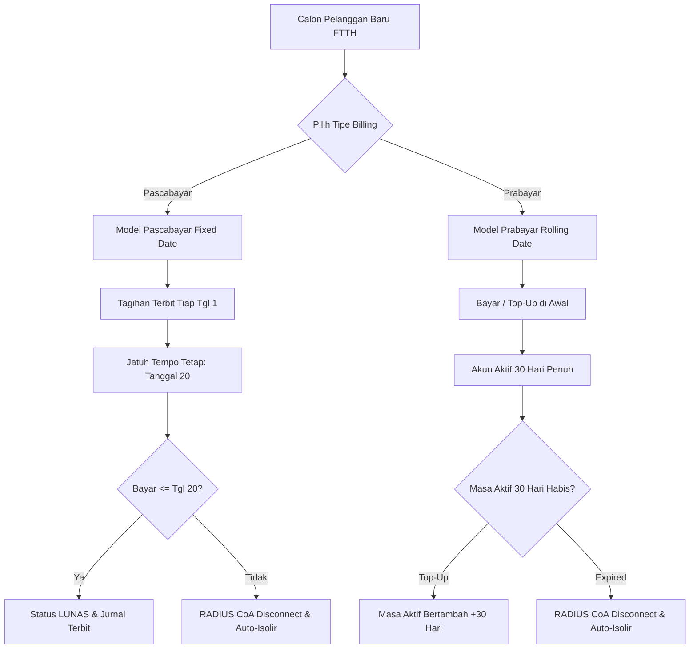
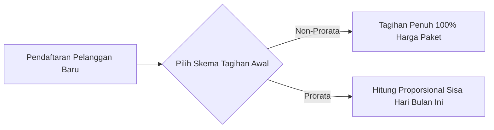
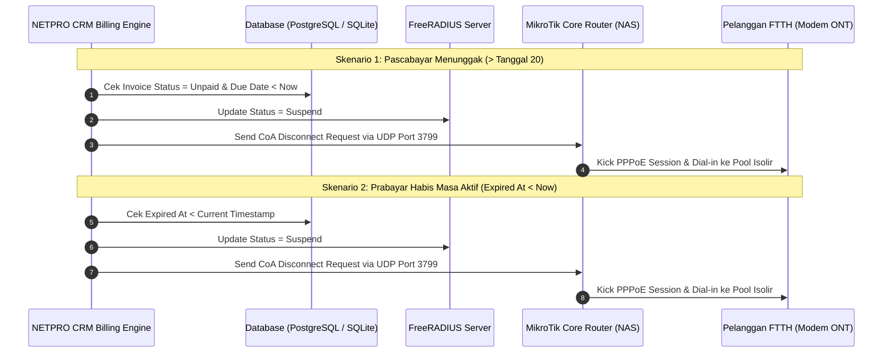

# 💳 DOKUMENTASI LENGKAP SISTEM BILLING: PASCABAYAR (FIXED DATE TGL 20), PRABAYAR (ROLLING 30 HARI) & KALKULASI PRORATA

**Standar Operasional Prosedur (SOP) Manajemen Penagihan, Masa Aktif, & Perpajakan ISP**  
**Aplikasi: NETPRO CRM (ISP Management OS)**

---

## 📑 DAFTAR ISI
1. [Arsitektur & Konsep Dual-Mode Billing ISP](#1-arsitektur--konsep-dual-mode-billing-isp)
2. [Model 1: Pascabayar (Postpaid Fixed Date - Jatuh Tempo Tgl 20)](#2-model-1-pascabayar-postpaid-fixed-date---jatuh-tempo-tgl-20)
3. [Model 2: Prabayar (Prepaid FTTH - Rolling Date 30 Hari)](#3-model-2-prabayar-prepaid-ftth---rolling-date-30-hari)
4. [Kalkulasi Tagihan Awal: Prorata vs Non-Prorata](#4-kalkulasi-tagihan-awal-prorata-vs-non-prorata)
5. [SOP Penggunaan di Aplikasi NETPRO CRM](#5-sop-penggunaan-di-aplikasi-netpro-crm)
   - 5.1. [Pendaftaran Pelanggan Baru (`crm/registrasi.php`)](#51-pendaftaran-pelanggan-baru-crmregistrasiphp)
   - 5.2. [Manajemen & Quick Top-Up Prabayar (`crm/daftar.php`)](#52-manajemen--quick-top-up-prabayar-crmdaftarphp)
   - 5.3. [Penerbitan Tagihan Massal Pascabayar (`billing/generate.php`)](#53-penerbitan-tagihan-massal-pascabayar-billinggeneratephp)
   - 5.4. [Monitoring Invoice & Pembayaran (`billing/daftar.php`)](#54-monitoring-invoice--pembayaran-billingdaftarphp)
6. [Integrasi Auto-Isolir RADIUS Server & CoA Disconnect (UDP Port 3799)](#6-integrasi-auto-isolir-radius-server--coa-disconnect-udp-port-3799)

---

## 1. Arsitektur & Konsep Dual-Mode Billing ISP

Sistem **NETPRO CRM** dirancang dengan fleksibilitas penuh untuk mendukung dua model bisnis utama industri penyedia jasa internet (ISP) di Indonesia:

---

## 2. Model 1: Pascabayar (Postpaid Fixed Date - Jatuh Tempo Tgl 20)

### Karakteristik Pascabayar:
1. **Penerbitan Tagihan Serentak (Tanggal 1)**:
   - Seluruh pelanggan aktif bertipe `postpaid` ditagih secara serentak pada tanggal 1 setiap bulan melalui menu [**Generate Tagihan Massal**](file:///d:/PG/BILL-DASH/billing/generate.php).
2. **Tanggal Jatuh Tempo Tetap (Fixed Date - Tanggal 20)**:
   - Batas akhir pembayaran ditetapkan secara standar pada **Tanggal 20** (`date('Y-m-20')`).
3. **Notifikasi WhatsApp Reminder**:
   - Bot WhatsApp mengirimkan link pembayaran (QRIS / Virtual Account) pada tanggal 1, pengingat H-3 (tanggal 17), dan pengingat hari-H (tanggal 20).
4. **Auto-Isolir Lewat Tanggal 20**:
   - Pelanggan yang belum melunasi tagihan setelah tanggal 20 secara otomatis di-kick dari Router NAS MikroTik via protokol **RADIUS CoA (Port 3799)** dan dialihkan ke IP Pool Isolir.

---

## 3. Model 2: Prabayar (Prepaid FTTH - Grace 30 Menit, Billing Cycle & Fixed Date)

Sistem Prabayar NETPRO CRM mendukung **2 Pilihan Siklus Masa Aktif** yang dapat ditentukan saat registrasi pelanggan:

### A. Sub-Pilihan Siklus Masa Aktif Prabayar:
1. **Billing Cycle (Rolling 30 Hari)** *(Default)*:
   * Masa aktif berjalan **30 hari penuh** sejak tanggal pembayaran / aktivasi.
   * *Contoh*: Pelanggan bayar tanggal **15 Agustus**, masa aktifnya berlaku hingga **14 September**. Tidak terikat batas akhir bulan kalender.
2. **Fixed Date (Reset Tanggal 1 Tiap Bulan)**:
   * Masa aktif diselaraskan berakhir pada **akhir bulan kalender berjalan** (`date('Y-m-t 23:59:59')`).
   * Menggunakan perhitungan **Prorata** untuk bulan pertama (misal pasang tgl 15–31 Agustus bayar 16 hari).
   * Pada tanggal **1 September**, pelanggan wajib melakukan top-up kembali untuk 1 bulan penuh ke depan.

---

### B. Karakteristik & Alur Kerja Prabayar (100% Otomatis):
1. **Status Registrasi Awal (`INACTIVE`)**:
   * Saat pelanggan baru didaftarkan, status akun awal adalah **`INACTIVE`** (Belum Online / Menunggu pemasangan ONT di lokasi), kredensial FreeRADIUS berstatus **`DISCONNECTED`**, dan invoice belum diterbitkan.
2. **Pemicu Aktivasi Otomatis (FreeRADIUS Accounting START)**:
   * Begitu modem pelanggan dicolok dan pertama kali melakukan dial-in PPPoE (*Online*), FreeRADIUS / MikroTik otomatis mengirim sinyal **`Accounting START`** ke endpoint [`api/radius_acct.php`](file:///d:/PG/BILL-DASH/api/radius_acct.php).
   * Sistem secara otomatis mengubah status pelanggan menjadi **`AKTIF`**, menerbitkan invoice tagihan perdana (**`UNPAID`**), dan memulai hitung mundur **Grace Period 30 Menit**.
3. **Grace Period Aktivasi 30 Menit**:
   * Pelanggan diberikan waktu koneksi internet aktif selama **30 Menit** (`expired_at = NOW() + 30 Menit`) untuk melakukan pengujian koneksi dan menyelesaikan pembayaran tagihan.
4. **Auto-Isolir jika Tidak Bayar dalam 30 Menit**:
   * Apabila dalam kurun waktu **30 menit** pelanggan **belum** melunasi invoice, sistem secara otomatis mengubah status pelanggan menjadi **`ISOLIR` (Suspended)** dan memutus sesi PPPoE ke Pool Isolir melalui **RADIUS CoA Disconnect (Port 3799)**.
4. **Masa Aktif Penuh Setelah Pembayaran (Lunas)**:
   * Begitu pembayaran invoice berhasil (via QRIS Dinamis, Kasir, atau Virtual Account), masa aktif akun otomatis diperpanjang sesuai siklus yang dipilih (**30 Hari Penuh** untuk Billing Cycle atau **Akhir Bulan** untuk Fixed Date) dan status kembali normal **`AKTIF`**.
5. **Fitur Quick Top-Up Perpanjangan**:
   * Tersedia tombol cepat **`+ Top-Up`** pada menu [**Daftar Pelanggan**](file:///d:/PG/BILL-DASH/crm/daftar.php) dengan pilihan durasi:
     - **+30 Hari / 1 Bulan Kalender**
     - **+60 Hari / 2 Bulan Kalender**
     - **+90 Hari / 1 Kuartal**
6. **Logika Perpanjangan Akun**:
   * Jika akun **masih aktif** (misal sisa 5 hari), perpanjangan dihitung bertambah dari tanggal *expired* yang sedang berjalan (`current_expired_at + durasi`).
   * Jika akun **sudah mati/expired**, perpanjangan dihitung dimulai dari hari pembayaran (`now + durasi`).

---

## 4. Kalkulasi Tagihan Awal: Prorata vs Non-Prorata

Saat pelanggan baru mendaftar di pertengahan bulan (misal tanggal 24), sistem menyediakan 2 pilihan perhitungan biaya bulan pertama:

### A. Rumus Perhitungan Prorata:
$$\text{Hari Tersisa} = \text{Total Hari Bulan Ini} - \text{Tanggal Hari Ini} + 1$$
$$\text{Faktor Prorata} = \frac{\text{Hari Tersisa}}{\text{Total Hari Bulan Ini}}$$
$$\text{Tarif Bersih Prorata} = \text{Harga Paket Normal} \times \text{Faktor Prorata}$$

### B. Simulasi Kasus Nyata:
* **Tanggal Registrasi**: 24 Agustus 2026 (Bulan Agustus = 31 Hari).
* **Sisa Hari Aktif**: $31 - 24 + 1 = 8\text{ Hari}$.
* **Paket Langganan**: `Home Premium 50M` (Harga: **Rp 250.000** - Include PPN 11%).

| Skema Tagihan Awal | Nilai Tagihan (Total Bayar) | Nilai DPP | Nilai PPN 11% | Keterangan Periode |
| :--- | :---: | :---: | :---: | :--- |
| **Non-Prorata (Penuh)** | **Rp 250.000** | Rp 225.225 | Rp 24.775 | `Agustus 2026` (1 Bulan Penuh) |
| **Prorata (Sisa 8 Hari)** | **Rp 64.516** | Rp 58.123 | Rp 6.393 | `August 2026 (Prorata 8/31 Hari)` |

---

## 5. SOP Penggunaan di Aplikasi NETPRO CRM

### 5.1. Pendaftaran Pelanggan Baru ([`crm/registrasi.php`](file:///d:/PG/BILL-DASH/crm/registrasi.php))
1. Masuk ke form registrasi 3 tahap (*3-Step Wizard*).
2. **Tahap 1**: Isi data identitas (NIK KTP, Nama, No. WhatsApp, Alamat).
3. **Tahap 2 (Paket & Billing)**:
   - Pilih **Tipe Model Penagihan**:
     - `🔘 Pascabayar (Postpaid Fixed Date - Jatuh Tempo Tgl 20)`
     - `🔘 Prabayar (Prepaid FTTH - Grace 30 Menit)`
   - Jika memilih **Prabayar**, tentukan **Pilihan Siklus**:
     - `🔘 Billing Cycle (Rolling 30 Hari)` *(Masa aktif 30 hari sejak bayar)*
     - `🔘 Fixed Date (Reset Tanggal 1)` *(Masa aktif diselaraskan akhir bulan)*
   - Pilih **Paket Internet** & **Skema PPN** (*Include PPN 11%* / *Exclude PPN 11%*).
   - Pilih **Skema Tagihan Awal**:
     - `🔘 Non-Prorata (Tagihan Penuh 1 Bulan)`
     - `🔘 Prorata (Sesuai Sisa Hari Bulan Ini)`
   - Kartu pratinjau (*Invoice Preview*) secara otomatis menampilkan kalkulasi DPP, PPN 11%, dan tanggal jatuh tempo/masa aktif secara real-time.
4. **Tahap 3**: Tentukan koordinat GPS dan credentials PPPoE FreeRADIUS. Klik **`Simpan & Daftarkan Pelanggan Baru`**.

---

### 5.2. Manajemen & Quick Top-Up Prabayar ([`crm/daftar.php`](file:///d:/PG/BILL-DASH/crm/daftar.php))
1. Buka tabel master pelanggan di [`crm/daftar.php`](file:///d:/PG/BILL-DASH/crm/daftar.php).
2. Kolom **Tipe Billing & Masa Aktif** menampilkan:
   - Pelanggan Prabayar: Badge warna ungu **`PRABAYAR`** disertai tag siklus (`ROLLING 30D` atau `FIXED DATE`) dan sisa masa aktif / status grace.
   - Pelanggan Pascabayar: Badge warna biru **`PASCABAYAR`** (*Jatuh Tempo: Tgl 20*).
3. Untuk melakukan top-up akun prabayar:
   - Klik tombol **`+ Top-up`** di baris pelanggan terkait.
   - Pilih durasi perpanjangan (**+30 Hari**, **+60 Hari**, atau **+90 Hari**).
   - Pilih metode pembayaran (*QRIS Dinamis*, *Kasir Tunai*, atau *VA Bank*).
   - Klik **`Proses Top-up & Terbitkan Invoice`**. Masa aktif otomatis bertambah dan invoice lunas langsung terbit.

---

### 5.3. Penerbitan Tagihan Massal Pascabayar ([`billing/generate.php`](file:///d:/PG/BILL-DASH/billing/generate.php))
1. Setiap awal bulan (tanggal 1), buka menu [**Generate Tagihan Massal**](file:///d:/PG/BILL-DASH/billing/generate.php).
2. Pilih Periode Tagihan (contoh: *September 2026*).
3. Tanggal Jatuh Tempo otomatis terisi **Tanggal 20** (`2026-09-20`).
4. Klik **`Jalankan Generate Tagihan`**.
5. Sistem secara cerdas **hanya menerbitkan tagihan untuk akun Pascabayar aktif** (akun Prabayar tidak akan ditagih dobel).

---

### 5.4. Monitoring Invoice & Pembayaran ([`billing/daftar.php`](file:///d:/PG/BILL-DASH/billing/daftar.php))
1. Seluruh riwayat invoice tagihan dapat dipantau di [`billing/daftar.php`](file:///d:/PG/BILL-DASH/billing/daftar.php).
2. Tabel invoice menampilkan badge tipe penagihan (**`PASCABAYAR`** atau **`PRABAYAR`**), rincian DPP, dan PPN 11%.
3. Untuk pembayaran manual via kasir offline, klik tombol **`Bayar`** untuk mengubah status invoice menjadi **`LUNAS`**.

---

## 6. Integrasi Auto-Isolir RADIUS Server & CoA Disconnect (UDP Port 3799)

Sistem auto-isolir terintegrasi langsung dengan Router Core MikroTik melalui protokol **RADIUS Change of Authorization (CoA Port 3799)**:

---

*Hak Cipta © 2026 PT NETPRO TELEKOMUNIKASI INDONESIA. Standar Operasional Billing ISP Indonesia.*
