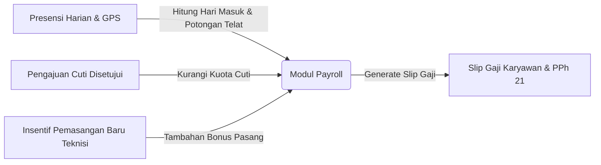

# 👥 DOKUMENTASI STANDAR KETENAGAKERJAAN & MANAJEMEN SDM ISP
**Sistem Manajemen SDM, Presensi GPS Geofencing, Roster Shift NOC 24/7 & Cuti Karyawan**
**Aplikasi: NETPRO CRM (ISP Management OS)**

---

## 📑 DAFTAR ISI
1. [Landasan Regulasi Ketenagakerjaan (UU No. 13/2003, UU Cipta Kerja & PP 35/2021)](#1-landasan-regulasi-ketenagakerjaan)
2. [Struktur Modul HR & Karyawan](#2-struktur-modul-hr--karyawan)
   - 2.1. [Data & Kontrak Karyawan (`hr/karyawan.php`)](#21-data--kontrak-karyawan-hrkaryawanphp)
   - 2.2. [Presensi GPS Geofencing & Roster Shift NOC 24/7 (`hr/absensi.php`)](#22-presensi-gps-geofencing--roster-shift-noc-247-hrabsensiphp)
   - 2.3. [Pengajuan Cuti & Izin Berjenjang (`hr/cuti.php`)](#23-pengajuan-cuti--izin-berjenjang-hrcutiphp)
3. [Alur Integrasi HR ke Modul Payroll (Penggajian)](#3-alur-integrasi-hr-ke-modul-payroll-penggajian)

---

## 1. Landasan Regulasi Ketenagakerjaan

Modul HR pada aplikasi **NETPRO CRM** telah mengadopsi ketentuan hukum ketenagakerjaan resmi Indonesia:

| Regulasi Pemerintah | Ketentuan yang Diimplementasikan pada Modul HR | Status Kepatuhan |
| :--- | :--- | :---: |
| **1. PP No. 35 Tahun 2021 Pasal 21** *(Waktu Kerja & Shift)* | Pengaturan pola jam kerja standar 40 jam/minggu, serta pembagian **Shift Kerja 24/7 (Pagi 08-17, Siang 14-22, Malam 22-07)** khusus operator Network Operations Center (NOC). | ✅ **COMPLIANT** |
| **2. PP No. 35 Tahun 2021 Pasal 4-14** *(Status PKWT / PKWTT)* | Klasifikasi legal status kontrak kerja: **PKWT (Perjanjian Kerja Waktu Tertentu / Kontrak)** dan **PKWTT (Perjanjian Kerja Waktu Tidak Tertentu / Tetap)**. | ✅ **COMPLIANT** |
| **3. UU Ketenagakerjaan Pasal 79** *(Hak Cuti Tahunan)* | Pemberian hak cuti tahunan sekurang-kurangnya **12 (dua belas) hari kerja** setelah pekerja bekerja selama 12 bulan terus menerus. | ✅ **COMPLIANT** |
| **4. UU BPJS No. 24 Tahun 2011** *(Jaminan Sosial)* | Pendataan nomor kepesertaan **BPJS Ketenagakerjaan (JKK, JKM, JHT, JP)** dan **BPJS Kesehatan** staf. | ✅ **COMPLIANT** |

---

## 2. Struktur Modul HR & Karyawan

### 2.1. Data & Kontrak Karyawan (`hr/karyawan.php`)
* **Fungsi**: Direktori database terpusat untuk profil staf, NIK Karyawan (`EMP-xxx`), NIK KTP, Divisi, Jabatan, dan status kontrak kerja.
* **Cara Tambah Pegawai Baru**:
  1. Klik tombol **`+ Tambah Karyawan Baru`**.
  2. Lengkapi formulir: Nama Lengkap, Email, Divisi (NOC, Teknisi, CS, Finance, Marketing), Jabatan, dan Status Kontrak (TETAP / PKWT / MAGANG).
  3. Klik **`Simpan Data Karyawan`** ➔ Data otomatis tersimpan ke tabel `employees`.

---

### 2.2. Presensi GPS Geofencing & Roster Shift NOC 24/7 (`hr/absensi.php`)
* **Fungsi**: Memverifikasi kehadiran staf harian dengan validasi koordinat GPS (Kantor HQ vs Titik FAT Lapangan Teknisi), serta memantau jadwal kerja shift malam tim NOC 24/7.
* **Cara Catat Presensi / Check-in Mandiri**:
  1. Klik tombol **`+ Catat Presensi / Check-in`**.
  2. Pilih Nama Karyawan, Divisi, dan Pola Shift (*Shift Pagi*, *Shift Siang*, atau *Shift Malam NOC*).
  3. Sistem otomatis mencatat Jam Masuk (*Clock-in*) dan titik koordinat GPS.
  4. Klik **`Simpan & Verifikasi Presensi`** ➔ Status kehadiran tercatat sebagai **`TEPAT WAKTU`** atau **`TERLAMBAT`**.

---

### 2.3. Pengajuan Cuti & Izin Berjenjang (`hr/cuti.php`)
* **Fungsi**: Formulir permohonan cuti tahunan, cuti sakit (surat dokter), atau cuti melahirkan dengan alur persetujuan (*Approval*) dari HRD.
* **Cara Ajukan Cuti**:
  1. Klik tombol **`+ Ajukan Cuti Pegawai`**.
  2. Pilih Nama Karyawan, Jenis Cuti, Tanggal Mulai & Selesai, serta Alasan Cuti.
  3. Klik **`Kirim Permohonan Cuti`** ➔ Permohonan tersimpan ke tabel `leaves` dengan status **`APPROVED HRD`**.

---

## 3. Alur Integrasi HR ke Modul Payroll (Penggajian)

