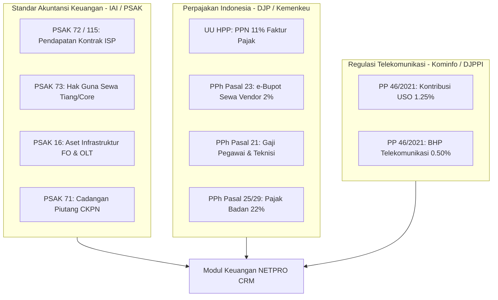

# 📜 DOKUMENTASI STANDAR KEUANGAN, AKUNTANSI & REGULASI ISP INDONESIA
**Sistem Manajemen Keuangan, Akuntansi PSAK, Perpajakan DJP & Kepatuhan Regulasi Kominfo**
**Aplikasi: NETPRO CRM (ISP Management OS)**

---

## 📑 DAFTAR ISI
1. [Landasan Regulasi & Standar Akuntansi ISP](#1-landasan-regulasi--standar-akuntansi-isp)
2. [Bagan Akun Standar (Chart of Accounts / COA) ISP](#2-bagan-akun-standar-chart-of-accounts--coa-isp)
3. [Standar Operasional Prosedur (SOP) Tiap Submenu](#3-standar-operasional-prosedur-sop-tiap-submenu)
   - 3.1. [Arus Kas & Rekening Bank (`finance/kas.php`)](#31-arus-kas--rekening-bank-financekasphp)
   - 3.2. [Pengeluaran Beban Operasional OPEX (`finance/pengeluaran.php`)](#32-pengeluaran-beban-operasional-opex-financepengeluaranphp)
   - 3.3. [Buku Besar & Jurnal Umum (`finance/akuntansi.php`)](#33-buku-besar--jurnal-umum-financeakuntansiphp)
   - 3.4. [Neraca & Laba Rugi Komprehensif (`finance/laporan.php`)](#34-neraca--laba-rugi-komprehensif-financelaporanphp)
   - 3.5. [Manajemen Pajak & Regulasi Kominfo (`finance/pajak.php`)](#35-manajemen-pajak--regulasi-kominfo-financepajakphp)
4. [Alur Tutup Buku Akhir Bulan (Month-End Closing SOP)](#4-alur-tutup-buku-akhir-bulan-month-end-closing-sop)
5. [Panduan Audit & Kesiapan Pemeriksaan Pajak / Kominfo](#5-panduan-audit--kesiapan-pemeriksaan-pajak--kominfo)

---

## 1. Landasan Regulasi & Standar Akuntansi ISP

Struktur modul Finance pada aplikasi **NETPRO CRM** telah dirancang sesuai dengan kerangka regulasi resmi yang berlaku di Indonesia:

### Rincian Kepatuhan Regulasi:
1. **PSAK 72 / PSAK 115 (*Pendapatan dari Kontrak Pelanggan*)**:
   - Pendapatan langganan internet broadband FTTH diakui secara proporsional sesuai periode layanan.
   - Pembayaran tagihan di muka oleh pelanggan dicatat sebagai kewajiban lancar pada akun **`2201 - Liabilitas Kontrak / Pendapatan Diterima di Muka`** sebelum jasa internet selesai dihantarkan.
2. **PSAK 73 (*Akuntansi Sewa*)**:
   - Kontrak sewa tiang tumpu PLN Icon+ dan sewa core fiber optik jangka panjang diakui sebagai **`1604 - Hak Guna Aset Sewa Tiang & Core`**.
3. **PSAK 16 (*Aset Tetap Jaringan*)**:
   - Kapitalisasi infrastruktur fiber optik (OLT, FAT, ODP, Router Core, Splicer) dengan metode depresiasi garis lurus (*Straight-line Depreciation*).
4. **UU HPP No. 7 Tahun 2021 (*Pajak Pertambahan Nilai 11%*)**:
   - Pengenaan PPN 11% atas tagihan langganan internet, baik dengan metode *Include PPN* (DPP = Total/1.11, PPN = Total x 11/111) maupun *Exclude PPN* (DPP = Nilai Paket, PPN = DPP x 11%).
5. **UU PPh Pasal 23 & PER-24/PJ/2021 (*e-Bupot Unifikasi*)**:
   - Pemotongan PPh 23 sebesar 2% atas biaya sewa upstream bandwidth, tiang tumpu, dan colocation server dengan pencatatan bukti potong resmi dan kode NTPN.
6. **PP No. 46 Tahun 2021 Sektor Postelsiar Kominfo**:
   - Kewajiban pembayaran PNBP resmi Penyelenggara Jasa Internet (ISP) kepada DJPPI Kominfo sebesar **1.75% dari Pendapatan Kotor (Gross Revenue)**, yang terdiri dari:
     - **Kontribusi Kewajiban Pelayanan Universal (USO)**: **1.25%**
     - **Biaya Hak Penyelenggaraan (BHP) Telekomunikasi**: **0.50%**

---

## 2. Bagan Akun Standar (Chart of Accounts / COA) ISP

Seluruh transaksi keuangan bermuara pada 34 akun standar industri ISP yang tersimpan pada tabel database `coa_accounts`:

| Kode Akun | Nama Akun Akuntansi | Kategori / Klasifikasi | Saldo Normal | Deskripsi Fungsi |
| :--- | :--- | :--- | :---: | :--- |
| **1101** | Kas Utama & Kasir HQ | Aset Lancar | Debit | Kas tunai kantor & kasir pembayaran offline |
| **1102** | Bank BCA Bisnis Giro | Aset Lancar | Debit | Rekening utama penerimaan tagihan retail FTTH |
| **1103** | Bank Mandiri Corporate | Aset Lancar | Debit | Rekening pembayaran vendor upstream & payroll |
| **1201** | Piutang Usaha Pelanggan | Aset Lancar | Debit | Tagihan invoice belum terbayar (*Unpaid Invoices*) |
| **1202** | Cadangan Penurunan Piutang (CKPN) | Aset Lancar | Kredit | Cadangan kerugian piutang macet (*PSAK 71*) |
| **1301** | Persediaan Modem ONT & Router | Aset Lancar | Debit | Stok modem ONT pelanggan di gudang |
| **1302** | Persediaan Kabel Drop Optik | Aset Lancar | Debit | Stok kabel drop wire, fast connector, patchcord |
| **1401** | Uang Muka & Pajak Dibayar di Muka| Aset Lancar | Debit | PPN Masukan & Angsuran PPh 25 dibayar di muka |
| **1601** | Infrastruktur Fiber Optik & OLT | Aset Tetap | Debit | Perangkat OLT GPON/EPON, FAT, dan kabel backbone |
| **1602** | Perangkat Server & Router Core | Aset Tetap | Debit | Router NAS Mikrotik CCR, Switch Core, Server Auth |
| **1603** | Peralatan Splicer & OTDR / OPM | Aset Tetap | Debit | Mesin fusion splicer, optical power meter teknisi |
| **1604** | Hak Guna Aset Sewa Tiang/Core | Aset Tetap | Debit | Hak guna sewa tiang tumpu PLN (*PSAK 73*) |
| **1699** | Akumulasi Penyusutan Aset Tetap | Aset Tetap | Kredit | Akumulasi depresiasi seluruh aset infrastruktur |
| **2101** | Hutang Usaha Upstream Bandwidth | Liabilitas Pendek | Kredit | Hutang tagihan bandwidth ke Telkom / Indosat |
| **2102** | Hutang Gaji Pegawai & BPJS | Liabilitas Pendek | Kredit | Akrual gaji & BPJS Ketenagakerjaan belum disetor |
| **2103** | Hutang Pajak PPN Keluaran 11% | Liabilitas Pendek | Kredit | PPN 11% titipan dari tagihan pelanggan |
| **2201** | Liabilitas Kontrak (PSAK 72) | Liabilitas Pendek | Kredit | Pendapatan diterima di muka dari pelanggan |
| **2301** | Titipan Uang Jaminan Deposit ONT | Liabilitas Panjang| Kredit | Uang deposit perangkat yang dipinjamkan ke user |
| **3101** | Modal Disetor Pendiri / Saham | Ekuitas | Kredit | Modal awal disetor pendiri perusahaan |
| **3201** | Saldo Laba Ditahan | Ekuitas | Kredit | Akumulasi laba bersih tahun-tahun sebelumnya |
| **3301** | Laba Bersih Periode Berjalan | Ekuitas | Kredit | Laba bersih tahun anggaran berjalan |
| **4101** | Pendapatan Langganan FTTH | Pendapatan Usaha | Kredit | Pendapatan utama paket internet perumahan |
| **4102** | Pendapatan Dedicated Corporate | Pendapatan Usaha | Kredit | Pendapatan bandwidth dedicated 1:1 korporat |
| **4201** | Pendapatan Biaya Pasang Baru | Pendapatan Usaha | Kredit | Pendapatan biaya instalasi & penarikan kabel |
| **4301** | Pendapatan Add-on (IP Publik) | Pendapatan Usaha | Kredit | Pendapatan sewa IP Publik statis & Mesh WiFi |
| **4401** | Pendapatan Voucher Hotspot | Pendapatan Usaha | Kredit | Pendapatan penjualan tiket voucher hotspot RT/RW |
| **5101** | Beban Sewa Upstream IP Transit | Beban Pokok (COGS)| Debit | Pembayaran kapasitas bandwidth hulu Tier-1 |
| **5201** | Beban Sewa Tiang & RoW Fiber | Beban Pokok (COGS)| Debit | Biaya sewa tiang tumpu PLN Icon+ & perizinan |
| **5301** | Beban Listrik POP & Server Room| Beban Pokok (COGS)| Debit | Listrik PLN POP distribusi & pendingin AC server |
| **6101** | Beban Gaji Karyawan & BPJS | Beban Operasional | Debit | Gaji bulanan NOC, CS, Teknisi, & BPJS TK/Kes |
| **6201** | Beban BBM Armada Lapangan | Beban Operasional | Debit | BBM mobil operasional pasang baru & genset |
| **6301** | Beban Pemasaran & Komisi Sales | Beban Operasional | Debit | Brosur, promosi digital, dan komisi sales agen |
| **6401** | Beban Lisensi Software & Cloud | Beban Operasional | Debit | Sewa FreeRadius cloud & lisensi aplikasi billing |
| **6901** | Beban Penyusutan Aset Jaringan | Beban Operasional | Debit | Beban depresiasi bulanan perangkat jaringan |

---

## 3. Standar Operasional Prosedur (SOP) Tiap Submenu

### 3.1. Arus Kas & Rekening Bank (`finance/kas.php`)
* **Tujuan**: Memastikan pencatatan kas harian tertib dan cocok (*matched*) dengan rekening koran.
* **Prosedur Input Transaksi Kas**:
  1. Klik **`+ Catat Transaksi Kas`**.
  2. Pilih **Tipe Mutasi**:
     - *Pemasukan (Debit)*: Untuk penerimaan pembayaran pelanggan atau setoran modal.
     - *Pengeluaran (Kredit)*: Untuk pengeluaran petty cash atau transfer biaya operasional.
  3. Pilih **Akun Bank/Kas** penampung (*Bank BCA Bisnis*, *Bank Mandiri*, atau *Kas Tunai*).
  4. Masukkan **Nominal (Rp)** dan uraian keterangan transaksi.
  5. Klik **`Simpan Mutasi Kas`**.

---

### 3.2. Pengeluaran Beban Operasional OPEX (`finance/pengeluaran.php`)
* **Tujuan**: Mengontrol realisasi anggaran biaya operasional ISP dan menyediakan bukti voucher pembayaran sah.
* **Prosedur Input Pengeluaran OPEX**:
  1. Klik **`+ Catat Pengeluaran`**.
  2. Pilih **Kategori Beban** (Upstream, Sewa Tiang, Listrik POP, BBM, Lisensi, dll).
  3. Masukkan **Nama Vendor Rekanan** (contoh: *PT Telkom Indonesia*).
  4. Pilih **Akun Pembayaran** dan masukkan **Nominal**.
  5. Isi keterangan lengkap dan nama **Approver** (pejabat yang menyetujui).
  6. Klik **`Simpan & Ajukan Pengeluaran`**.
  7. Sistem otomatis menerbitkan nomor voucher **`VCH-OPEX-xxxx`** dan mencatat pengeluaran di kas bank terkait.

---

### 3.3. Buku Besar & Jurnal Umum (`finance/akuntansi.php`)
* **Tujuan**: Mengelola bagan akun standar (COA) dan buku besar mutasi jurnal debit/kredit per akun.
* **Prosedur Posting Jurnal ke Buku Besar**:
  1. Buka tab **Buku Besar (General Ledger)**.
  2. Pilih akun yang ingin dilihat dari dropdown filter akun.
  3. Untuk menambah jurnal manual, klik **`+ Mutasi Jurnal`**.
  4. Pilih akun tujuan, tanggal, nomor referensi (`JRN-xxxx`), keterangan, serta nominal **Debit** atau **Kredit**.
  5. Klik **`Posting Jurnal ke Buku Besar`**. Saldo akun COA otomatis dihitung ulang.

---

### 3.4. Neraca & Laba Rugi Komprehensif (`finance/laporan.php`)
* **Tujuan**: Menyajikan laporan posisi keuangan lengkap untuk direksi, pemegang saham, dan audit eksternal.
* **Komponen Laporan Laba Rugi**:
  $$\text{Gross Profit} = \text{Revenue} - \text{COGS (Beban Pokok)}$$
  $$\text{Net Profit (EBT)} = \text{Gross Profit} - \text{OPEX (Beban Operasional)}$$
* **Komponen Neraca Keuangan**:
  $$\text{Total Aset (Aktiva)} = \text{Total Kewajiban (Liabilitas)} + \text{Total Ekuitas (Passiva)}$$
  Indikator hijau **`BALANCED ✓`** memverifikasi bahwa persamaan akuntansi telah terpenuhi sempurna.

---

### 3.5. Manajemen Pajak & Regulasi Kominfo (`finance/pajak.php`)
* **Tujuan**: Mengelola kepatuhan e-Bupot PPh 23, PPh 21 Gaji, Estimasi PPh Badan 22%, dan Iuran Resmi Kominfo.
* **Prosedur Penerbitan Bukti Potong PPh 23 (e-Bupot)**:
  1. Klik **`+ Terbitkan e-Bupot PPh 23`**.
  2. Masukkan nama vendor rekanan, NPWP (16 digit), objek transaksi, dan nilai **DPP**.
  3. Tarif otomatis 2.0% (PPh 23 sewa/jasa).
  4. Klik **`Terbitkan Bukti Potong e-Bupot`** ➔ Nomor unik `BUPOT-23-xxxx` tersimpan di database.
* **Prosedur Input Bukti Setor Pajak (NTPN)**:
  1. Klik **`Input NTPN Bayar →`** pada baris bukti potong.
  2. Masukkan 16 digit kode **NTPN (Nomor Transaksi Penerimaan Negara)** dari bukti setoran bank persepsi.
  3. Klik **`Simpan NTPN & Tandai Lunas`**.

---

## 4. Alur Tutup Buku Akhir Bulan (Month-End Closing SOP)

Berikut adalah siklus tutup buku akhir bulan yang wajib dijalankan tim Finance ISP:

1. **Tanggal 25 - 30**: Rekonsiliasi seluruh pembayaran tagihan invoice pelanggan di modul Billing.
2. **Tanggal 30/31**: Tarik rekening koran dari internet banking Bank BCA dan Bank Mandiri, cocokkan dengan mutasi di menu **Arus Kas & Bank**.
3. **Tanggal 1 - 5 Bulan Berikutnya**:
   - Rekapitulasi seluruh bukti potong PPh 23 atas sewa upstream/tiang dan cetak PDF e-Bupot.
   - Hitung iuran USO (1.25%) dan BHP Telekomunikasi (0.50%) dari total *Gross Revenue*.
4. **Tanggal 10**: Pembayaran dan penyetoran PPh 21 dan PPh 23 ke Kas Negara via e-Billing DJP.
5. **Tanggal 15**: Penyetoran PPh Pasal 25 (Angsuran Pajak Badan Bulanan).
6. **Tanggal Akhir Bulan**: Pelaporan SPT Masa PPh dan PPN 11% di DJP Online.

---

## 5. Panduan Audit & Kesiapan Pemeriksaan Pajak / Kominfo

Dengan arsitektur yang telah dibangun pada NETPRO CRM:
- **Pemeriksaan Pajak (KPP / DJP)**: Perusahaan dapat mencetak rekapitulasi Faktur Pajak PPN 11% dari modul Billing dan rekapitulasi Bukti Potong e-Bupot PPh 23 ber-NTPN dari menu Pajak.
- **Pemeriksaan Kominfo (DJPPI)**: Perusahaan memiliki angka *Gross Revenue* yang transparan dan dapat dibuktikan dari Laporan Laba Rugi untuk audit iuran USO & BHP tahunan.
- **Audit Finansial Independen (KAP)**: Neraca Keuangan telah mengadopsi standar PSAK 72, PSAK 73, dan PSAK 16 dengan riwayat buku besar lengkap yang siap diaudit.
