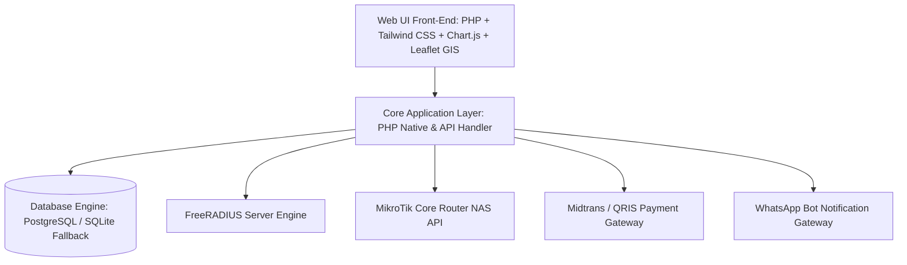
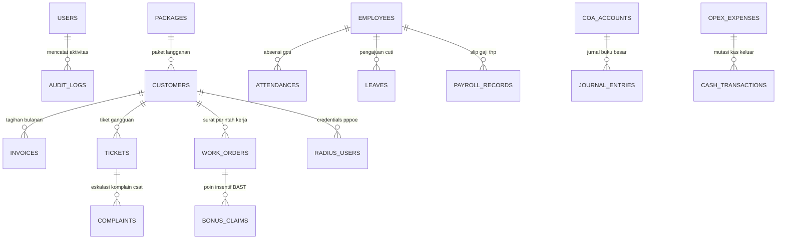
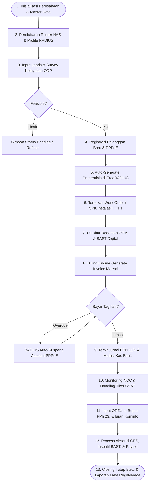

# 🚀 PANDUAN RESMI ALUR PENGGUNAAN NETPRO CRM (ISP MANAGEMENT OS)

**Manual Operasional & Panduan Sistem Perusahaan Jasa Akses Internet (ISP)**  
**Standar Regulasi Kominfo, DJP Perpajakan Indonesia, & Akuntansi PSAK**

---

## 📑 DAFTAR ISI
1. [Gambaran Umum & Arsitektur Sistem](#1-gambaran-umum--arsitektur-sistem)
2. [Desain Database & Diagram Relasi Entitas (ERD 33 Tabel)](#2-desain-database--diagram-relasi-entitas-erd-33-tabel)
3. [Diagram Flowchart Alur Penggunaan Aplikasi End-to-End](#3-diagram-flowchart-alur-penggunaan-aplikasi-end-to-end)
4. [Petunjuk Lengkap Input Data & Operasional (Tahap 1 - 8)](#4-petunjuk-lengkap-input-data--operasional-tahap-1---8)
   - 4.1. [Tahap 1: Setup Perusahaan, Katalog Paket & RADIUS NAS](#41-tahap-1-setup-perusahaan-katalog-paket--radius-nas)
   - 4.2. [Tahap 2: Marketing Leads & Survey Kelayakan ODP](#42-tahap-2-marketing-leads--survey-kelayakan-odp)
   - 4.3. [Tahap 3: Onboarding Pelanggan Baru & Integrasi FreeRADIUS](#43-tahap-3-onboarding-pelanggan-baru--integrasi-freeradius)
   - 4.4. [Tahap 4: Work Order (SPK) Instalasi FTTH & BAST Digital](#44-tahap-4-work-order-spk-instalasi-ftth--bast-digital)
   - 4.5. [Tahap 5: Billing Engine Massal, PPN 11% & Auto-Suspend RADIUS](#45-tahap-5-billing-engine-massal-ppn-11--auto-suspend-radius)
   - 4.6. [Tahap 6: NOC Live Monitoring, Incident Cut & Ticket SLA](#46-tahap-6-noc-live-monitoring-incident-cut--ticket-sla)
   - 4.7. [Tahap 7: Keuangan, Akuntansi PSAK, e-Bupot PPh 23 & Kominfo](#47-tahap-7-keuangan-akuntansi-psak-e-bupot-pph-23--kominfo)
   - 4.8. [Tahap 8: HRD Absensi GPS & Payroll THP Karyawan](#48-tahap-8-hrd-absensi-gps--payroll-thp-karyawan)
5. [SOP Tutup Buku Akhir Bulan & Rekonsiliasi Keuangan](#5-sop-tutup-buku-akhir-bulan--rekonsiliasi-keuangan)

---

## 1. Gambaran Umum & Arsitektur Sistem

Sistem **NETPRO CRM** adalah sistem operasi bisnis terintegrasi (*ISP Operating System*) yang mencakup seluruh aspek operasional ISP Indonesia:

### Keunggulan Arsitektur:
- **Dual-Database Auto Switch**: Sistem menggunakan PostgreSQL (`billdash`) sebagai database utama, dan otomatis berpindah (*fallback*) ke SQLite lokal ([`database/app.db`](file:///d:/PG/BILL-DASH/database/app.db)) jika PostgreSQL tidak aktif.
- **RADIUS Engine Integration**: Credentials PPPoE & Hotspot yang diinput pada CRM otomatis tersimpan ke tabel `radius_users` untuk dibaca oleh server FreeRADIUS.
- **Perpajakan & Regulasi Indonesia**: Mendukung PPN 11% (Include/Exclude), e-Bupot PPh 23 (2%), serta Iuran Kominfo PNBP (USO 1.25% & BHP 0.50%).

---

## 2. Desain Database & Diagram Relasi Entitas (ERD 33 Tabel)

Sistem didukung oleh **33 tabel database** yang terstruktur rapat dengan *foreign keys*:

### Tabel Utama & Fungsinya:
1. `users`: Akun admin, login, & RBAC hak akses.
2. `packages`: Katalog paket internet (speed Mbps, harga, PPN mode).
3. `customers`: Master data pelanggan (CID, NIK, koordinat GPS, PPPoE user/pass).
4. `invoices`: Tagihan bulanan (DPP, PPN 11%, status paid/unpaid, due date).
5. `surveys`: Hasil survey lokasi calon pelanggan & jarak ODP.
6. `work_orders`: Surat Perintah Kerja (SPK) instalasi FTTH & redaman OPM.
7. `addons`: Layanan tambahan (IP Publik Statis, Mesh WiFi).
8. `promos`: Kode voucher diskon langganan.
9. `radius_nas`: Perangkat Router NAS MikroTik terhubung RADIUS.
10. `radius_users`: Credentials username/password PPPoE & Hotspot real-time.
11. `radius_profiles`: Rate-limit queue kecepatan bandwidth.
12. `radius_vouchers`: Batch voucher hotspot RT/RW.
13. `noc_outages`: Feed insiden putus kabel fiber optik / ODP redup.
14. `tickets`: Tiket gangguan CS & penugasan teknisi NOC.
15. `complaints`: Catatan komplain kritis, CSAT, & NPS score.
16. `employees`: Master data karyawan, teknisi, & staf HQ.
17. `leaves`: Pengajuan cuti & perizinan pegawai.
18. `attendances`: Absensi presensi GPS lokasi kantor/lapangan.
19. `inventory_items`: Stok material gudang (Modem ONT, Dropcore, Splicer).
20. `cash_transactions`: Buku kas & mutasi bank penampung.
21. `leads`: Prospek calon pelanggan dari tim Sales/Marketing.
22. `settings`: Identitas perusahaan, NPWP, & tarif PPN global.
23. `branches`: Kantor cabang operasional ISP.
24. `coa_accounts`: Chart of Accounts (Bagan 34 Akun Akuntansi PSAK).
25. `journal_entries`: Jurnal umum & mutasi buku besar debit/kredit.
26. `tax_records`: Bukti potong e-Bupot PPh 23 & kode setoran NTPN.
27. `opex_expenses`: Pengeluaran beban operasional & voucher pengeluaran.
28. `kpi_indicators`: Indikator penilaian kinerja divisi.
29. `performance_reviews`: Nilai evaluasi teknis & kedisiplinan pegawai.
30. `salary_components`: Komponen gaji pokok, tunjangan, & potongan.
31. `payroll_records`: Slip gaji THP bulanan karyawan.
32. `bonus_claims`: Klaim insentif poin BAST per titik pasang baru.
33. `backups`: Snapshot cadangan database SQLite/PostgreSQL.

---

## 3. Diagram Flowchart Alur Penggunaan Aplikasi End-to-End

---

## 4. Petunjuk Lengkap Input Data & Operasional (Tahap 1 - 8)

### 4.1. Tahap 1: Setup Perusahaan, Katalog Paket & RADIUS NAS
* **Halaman**: [`pengaturan/perusahaan.php`](file:///d:/PG/BILL-DASH/pengaturan/perusahaan.php) & [`marketing/paket.php`](file:///d:/PG/BILL-DASH/marketing/paket.php).
* **Langkah Input**:
  1. Masukkan Nama Perusahaan (*PT NETPRO TELEKOMUNIKASI INDONESIA*), NPWP, Alamat HQ, dan Tarif PPN 11%.
  2. Daftarkan Katalog Paket Internet:
     - Nama Paket: `Home Premium 50M`
     - Kecepatan: `50` Mbps
     - Harga: `Rp 250.000`
     - Skema PPN: `Include PPN`
  3. Daftarkan Router NAS MikroTik di [`radius/nas.php`](file:///d:/PG/BILL-DASH/radius/nas.php):
     - IP Address: `10.100.0.1`, Secret: `radiussecret123`.
     - *Panduan teknis lengkap RADIUS AAA & Change of Authorization (CoA Port 3799) tersedia di [`DOKUMENTASI_INTEGRASI_RADIUS_NAS_DAN_COA.md`](file:///d:/PG/BILL-DASH/DOKUMENTASI_INTEGRASI_RADIUS_NAS_DAN_COA.md).*

---

### 4.2. Tahap 2: Marketing Leads & Survey Kelayakan ODP
* **Halaman**: [`marketing/leads.php`](file:///d:/PG/BILL-DASH/marketing/leads.php) & [`crm/survey.php`](file:///d:/PG/BILL-DASH/crm/survey.php).
* **Langkah Input**:
  1. Tim Sales menginput calon pelanggan baru.
  2. Tim Survey mengecek ODP terdekat (contoh: `ODP-JTW-04/16`) dan jarak penarikan kabel dropcore (meter).
  3. Hasil survey disimpan sebagai **`FEASIBLE (LAYAK)`**.

---

### 4.3. Tahap 3: Onboarding Pelanggan Baru & Integrasi FreeRADIUS
* **Halaman**: [`crm/registrasi.php`](file:///d:/PG/BILL-DASH/crm/registrasi.php).
* **Langkah Input Pelanggan (3-Step Wizard)**:
  - **Identitas**: NIK KTP (16-digit), Nama Pelanggan, No. WA, Alamat Lengkap.
  - **Paket & Tipe Billing**:
    - **Pascabayar (Postpaid)**: Tagihan rutin bulanan jatuh tempo tanggal 10.
    - **Prabayar (Prepaid FTTH)**: Bayar di awal, masa aktif otomatis 30 hari.
    - **Skema PPN**: *Include PPN 11%* / *Exclude PPN 11%*.
  - **Aktivasi & RADIUS**: Koordinat GPS Leaflet Map, Username & Password PPPoE dial-up.
* **Hasil Otomatis**:
  - Data tersimpan di tabel `customers` dan `radius_users`.
  - Pelanggan Prabayar langsung terbit invoice lunas & masa aktif 30 hari.
  - Pelanggan Pascabayar terbit invoice `unpaid` dengan jatuh tempo tanggal 10.

---

### 4.4. Tahap 4: Work Order (SPK) Instalasi FTTH & BAST Digital
* **Halaman**: [`crm/instalasi.php`](file:///d:/PG/BILL-DASH/crm/instalasi.php) & [`crm/berita_acara.php`](file:///d:/PG/BILL-DASH/crm/berita_acara.php).
* **Langkah Input**:
  1. Sistem meng-generate Surat Perintah Kerja (`WO-2026-0001`).
  2. Teknisi memasang ONT ZTE (SN: `ZTEG8829102`), mengukur redaman optik OPM (contoh: `-18.4 dBm`), dan menyelesaikan perakitan.
  3. Sistem menggenerasi BAST Digital ([`crm/cetak_bast.php`](file:///d:/PG/BILL-DASH/crm/cetak_bast.php)) yang dapat diprint ke PDF atau dikirim via WhatsApp.

---

### 4.5. Tahap 5: Dual Billing Engine, PPN 11% & Auto-Suspend RADIUS
* **Halaman**: [`billing/generate.php`](file:///d:/PG/BILL-DASH/billing/generate.php), [`billing/daftar.php`](file:///d:/PG/BILL-DASH/billing/daftar.php) & [`crm/daftar.php`](file:///d:/PG/BILL-DASH/crm/daftar.php).
* **Perhitungan PPN 11%**:
  - **Include PPN**: $\text{DPP} = \frac{\text{Total}}{1.11}$, $\text{PPN} = \text{Total} - \text{DPP}$.
  - **Exclude PPN**: $\text{DPP} = \text{Harga Paket}$, $\text{PPN} = \text{DPP} \times 11\%$.
* **Langkah Operasional**:
  1. **Pelanggan Pascabayar**: Jalankan **`Generate Tagihan Massal`** di awal bulan. Invoice terbit untuk seluruh akun pascabayar aktif dengan jatuh tempo tgl 10.
  2. **Pelanggan Prabayar**: Melakukan perpanjangan via tombol **`+ Top-Up`** (+30 hari, +60 hari) di [`crm/daftar.php`](file:///d:/PG/BILL-DASH/crm/daftar.php). Masa aktif otomatis bertambah & invoice lunas langsung terbit.
  3. **Auto-Isolir (Suspension)**: Jika tagihan pascabayar lewat due date atau masa aktif prabayar habis, RADIUS mengirimkan paket **CoA Disconnect (Port 3799)** ke Router NAS MikroTik.

---

### 4.6. Tahap 6: NOC Live Monitoring, Incident Cut & Ticket SLA
* **Halaman**: [`dashboard/noc.php`](file:///d:/PG/BILL-DASH/dashboard/noc.php), [`noc/outage.php`](file:///d:/PG/BILL-DASH/noc/outage.php), & [`tickets/list.php`](file:///d:/PG/BILL-DASH/tickets/list.php).
* **Langkah Operasional**:
  1. NOC memantau trafik bandwidth 10G & status OLT secara real-time.
  2. Input insiden kabel fiber optik putus (*FO Trunk Cut*) beserta lokasi dan jumlah user terdampak.
  3. CS mencatat tiket gangguan pelanggan (`TCK-8921`) dengan SLA penanganan teknisi.

---

### 4.7. Tahap 7: Keuangan, Akuntansi PSAK, e-Bupot PPh 23 & Kominfo
* **Halaman**: [`finance/kas.php`](file:///d:/PG/BILL-DASH/finance/kas.php), [`finance/pengeluaran.php`](file:///d:/PG/BILL-DASH/finance/pengeluaran.php), [`finance/akuntansi.php`](file:///d:/PG/BILL-DASH/finance/akuntansi.php), & [`finance/pajak.php`](file:///d:/PG/BILL-DASH/finance/pajak.php).
* **Bagan Akun Standard (COA 34 Akun)**:
  - `1102 - Bank BCA Bisnis`, `2103 - Hutang PPN Keluaran 11%`, `4101 - Pendapatan FTTH`, `5101 - Beban Upstream Bandwidth`, dll.
* **Prosedur e-Bupot PPh 23 & Iuran Kominfo**:
  1. Input Bukti Potong e-Bupot PPh 23 (2.0%) atas sewa vendor upstream/tiang. Masukkan kode setoran **NTPN** dari bank.
  2. Iuran Resmi Kominfo (PNBP) dihitung otomatis dari Gross Revenue:
     $$\text{USO (1.25\%)} + \text{BHP Telekomunikasi (0.50\%)} = 1.75\% \text{ Gross Revenue}$$

---

### 4.8. Tahap 8: HRD Absensi GPS & Payroll THP Karyawan
* **Halaman**: [`hr/absensi.php`](file:///d:/PG/BILL-DASH/hr/absensi.php), [`payroll/bonus.php`](file:///d:/PG/BILL-DASH/payroll/bonus.php), & [`payroll/gaji.php`](file:///d:/PG/BILL-DASH/payroll/gaji.php).
* **Langkah Operasional**:
  1. Teknisi melakukan clock-in presensi GPS.
  2. Teknisi mengklaim poin bonus BAST per titik pasang baru (`BAST-NETPRO/...`).
  3. HRD memproses slip gaji THP (Gaji Pokok + Tunjangan + Insentif BAST - Potongan BPJS/PPh 21).

---

## 5. SOP Tutup Buku Akhir Bulan & Rekonsiliasi Keuangan

1. **Tanggal 25 - 30**: Rekonsiliasi invoice penagihan pelanggan.
2. **Tanggal 30/31**: Matching rekening koran Bank BCA & Mandiri dengan mutasi kas aplikasi.
3. **Tanggal 01 - 05**: Rekapitulasi e-Bupot PPh 23 & hitung kewajiban Kominfo USO/BHP.
4. **Tanggal 10**: Setor PPh 21 Gaji & PPh 23 e-Bupot via e-Billing DJP.
5. **Tanggal 15**: Setor PPh 25 Angsuran Pajak Badan Bulanan.
6. **Tanggal Akhir Bulan**: Pelaporan SPT Masa PPN 11% & e-Faktur DJP Online.
