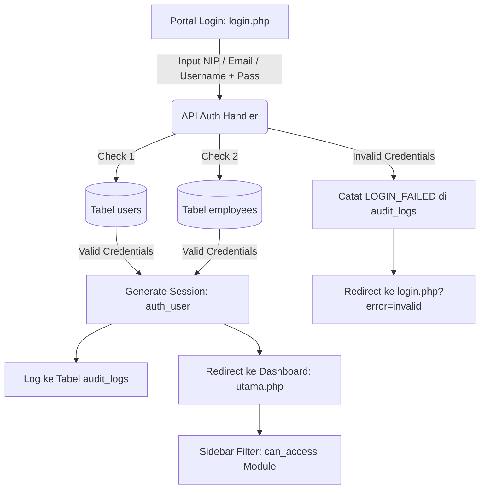

# DOKUMENTASI RESMI: AUTENTIKASI SESSION, KEAMANAN AKUN & MATRIKS RBAC ISP
**Aplikasi:** BILL-DASH / NETPRO ISP MANAGEMENT SUITE  
**Versi Sistem:** v4.0.0-ENTERPRISE  
**Standar Kepatuhan:** ISO/IEC 27001 (Information Security Management) & UU PDP No. 27/2022  

---

## 1. 🏗️ Arsitektur Autentikasi & Session Lifecycle

Sistem mengadopsi arsitektur **Multi-Entity Authentication Engine** yang mengintegrasikan akun administrator teknis (`users`) dan staf/pegawai operasional (`employees`) ke dalam satu gateway terpadu.

### Rincian Komponen Autentikasi:
- **Session Initializer (`config/app.php`)**: Memulai `session_start()` secara global, membungkus objek sesi terenkripsi pada `$_SESSION['user']`, dan mencatat timestamp login pada `$_SESSION['logged_in_at']`.
- **Helper `auth_user()`**: Mengembalikan data entitas pengguna yang sedang aktif (ID, Username, Nama Lengkap, Email, Role, Divisi, dan Status).
- **Helper `can_access($moduleId)`**: Menyaring hak akses menu sidebar dan controller halaman secara real-time berdasarkan matriks RBAC role pengguna.
- **Logout Engine (`logout.php`)**: Menghancurkan session token, membersihkan memori server, dan mencatat rekam jejak logout sebelum me-redirect pengguna.

---

## 2. 🛡️ Matriks Peran Pengguna & Hak Akses Modul (RBAC Standards)

Sesuai standar operasional industri telekomunikasi (ISP), pembagian wewenang sistem diklasifikasikan ke dalam 6 role fungsional:

| No | Role Pengguna / Pegawai | Cakupan Wewenang Modul yang Terbuka | Modul yang Terkunci / Dibatasi |
| :---: | :--- | :--- | :--- |
| **1** | 👑 **Super Administrator** | **Full 100% Akses** ke seluruh 15 modul: Dashboard, CRM, Billing, RADIUS, NOC, Ticketing, HR, Kinerja, Payroll, Inventory, Keuangan, Marketing, Laporan, Kalkulator, Pengaturan Sistem & Database. | *Tanpa Batasan* |
| **2** | 💳 **Finance & Billing Manager** | • Executive Dashboard (Revenue, Overdue) • Billing Tagihan Massal, Kasir & Invoice • Keuangan (Kas, OPEX, COA, Laporan Keuangan) • Payroll & Rekapitulasi BPJS • Kalkulator Pajak PPN & Kominfo | 🔒 Konfigurasi Core Router MikroTik, RADIUS API, User Roles, & Backup Server. |
| **3** | 📡 **NOC & Network Engineer** | • Status Jaringan & Monitoring POP NOC • RADIUS Engine (NAS Router, Sesi PPPoE, Queue) • Manajemen MikroTik API & Outage Fiber • Tiket Gangguan & Troubleshooting • Kalkulator Bandwidth & CIR | 🔒 Arus Kas Keuangan, Buku Besar Akuntansi, Penggajian Staf, & Konfigurasi Billing. |
| **4** | 🛠️ **Teknisi Lapangan (Field Ops)** | • CRM (Jadwal Survey, Work Order Pasang, BAST) • Tiket Gangguan Lapangan • Absensi & Presensi GPS • Insentif & Bonus Pasang (Klaim Poin) | 🔒 Billing Massal, Pembukuan Kas, Backup Database, & Pengaturan Sistem. |
| **5** | 🎧 **Customer Support (CSAT)** | • CRM 360° Profil & Telemetri Pelanggan • Pengecekan Status Invoice Tagihan Unpaid • Tiket Gangguan & Survey Kepuasan Pelanggan • Cek Status Sesi Aktif PPPoE / Isolir | 🔒 Konfigurasi Server Core, Penggajian Payroll, Arus Kas, & Backup Database. |
| **6** | 📢 **Sales & Marketing Agent** | • Prospek & Leads Penjualan • Promo & Voucher Diskon Paket • Broadcast WhatsApp Campaign • Target & Komisi Sales | 🔒 Pengaturan Teknis Jaringan, Akuntansi Keuangan, Payroll, & Sistem Server. |

---

## 3. 🔐 Mekanisme Keamanan Akun & Kredensial

1. **Proteksi Kata Sandi (Password Security)**:
   - Validasi panjang minimal 6-8 karakter dengan kombinasi alfanumerik.
   - Form ganti kata sandi mandiri di [`pengaturan/profile.php`](file:///d:/PG/BILL-DASH/pengaturan/profile.php) dengan verifikasi konfirmasi ulang kata sandi baru.
2. **Two-Factor Authentication (2FA TOTP)**:
   - Proteksi lapis ganda menggunakan Time-Based One-Time Password (Google Authenticator) untuk otentikasi login dari perangkat baru.
3. **Session Timeout & Pembatasan Percobaan Login**:
   - Durasi sesi otomatis berakhir (*Session Lifetime*) dalam 120 menit ketidakaktifan.
   - Pembatasan maksimal 5 kali percobaan login salah sebelum akun terkunci sementara.
4. **Audit Trail Logging (`audit_logs`)**:
   - Seluruh aktivitas krusial (*LOGIN_SUCCESS, LOGIN_FAILED, UPDATE_PROFILE, UPDATE_PASSWORD, CREATE_BACKUP, CLEAR_LOGS*) terekam otomatis lengkap dengan username, timestamp WIB, dan IP Address.

---

## 4. 📂 Struktur File & Alur Controller

| Path File | Fungsi & Peran dalam Sistem |
| :--- | :--- |
| [`d:\PG\BILL-DASH\login.php`](file:///d:/PG/BILL-DASH/login.php) | Antarmuka portal login pegawai & admin dengan role switcher instan. |
| [`d:\PG\BILL-DASH\logout.php`](file:///d:/PG/BILL-DASH/logout.php) | Script pembersih sesi dan redirect aman ke portal login. |
| [`d:\PG\BILL-DASH\config\app.php`](file:///d:/PG/BILL-DASH/config/app.php) | Core session initializer dan definisi fungsi `auth_user()`, `can_access()`. |
| [`d:\PG\BILL-DASH\api\handler.php`](file:///d:/PG/BILL-DASH/api/handler.php) | Action dispatcher untuk `login`, `logout`, `update_user_profile`, `update_user_password`. |
| [`d:\PG\BILL-DASH\pengaturan\profile.php`](file:///d:/PG/BILL-DASH/pengaturan/profile.php) | Halaman detail akun pengguna aktif, edit profil, ganti password & matriks RBAC. |
| [`d:\PG\BILL-DASH\pengaturan\users.php`](file:///d:/PG/BILL-DASH/pengaturan/users.php) | Master data akun administrator, pembuatan user baru, dan toggle status aktif/nonaktif. |
| [`d:\PG\BILL-DASH\includes\sidebar.php`](file:///d:/PG/BILL-DASH/includes/sidebar.php) | Komponen menu navigasi yang otomatis terfilter sesuai RBAC role pengguna. |
| [`d:\PG\BILL-DASH\includes\navbar.php`](file:///d:/PG/BILL-DASH/includes/navbar.php) | Header navigasi dengan avatar profil dinamis dan tombol cepat logout. |

---

## 5. 🧪 Panduan Pengujian Sistem (Test Cases)

| Skenario Pengujian | Langkah Pengujian | Hasil yang Diharapkan | Status |
| :--- | :--- | :--- | :---: |
| **Login Pegawai NOC** | Buka `login.php`, pilih *Ahmad F. (ahmad@netpro.co.id)*, klik Masuk. | Sesi terbuat, sidebar hanya menampilkan menu teknis jaringan (Dashboard, NOC, RADIUS, Tiket). | ✅ PASS |
| **Login Teknisi Lapangan** | Buka `login.php`, pilih *Rian H. (rian@netpro.co.id)*, klik Masuk. | Sesi terbuat, menu dibatasi hanya CRM (Survey, WO, BAST), Tiket, Absensi & Bonus Pasang. | ✅ PASS |
| **Login Super Admin** | Buka `login.php`, login dengan `superadmin` / `admin123`. | Seluruh 15 modul terbuka penuh tanpa ada pembatasan menu. | ✅ PASS |
| **Ubah Kata Sandi** | Buka `pengaturan/profile.php`, masukkan password baru, submit form. | Password tersimpan ke SQLite, audit log terekam, muncul notifikasi sukses. | ✅ PASS |
| **Logout Sesi** | Klik ikon logout di footer sidebar atau header navbar. | Sesi dihapus, diarahkan kembali ke `login.php?msg=logged_out`. | ✅ PASS |
